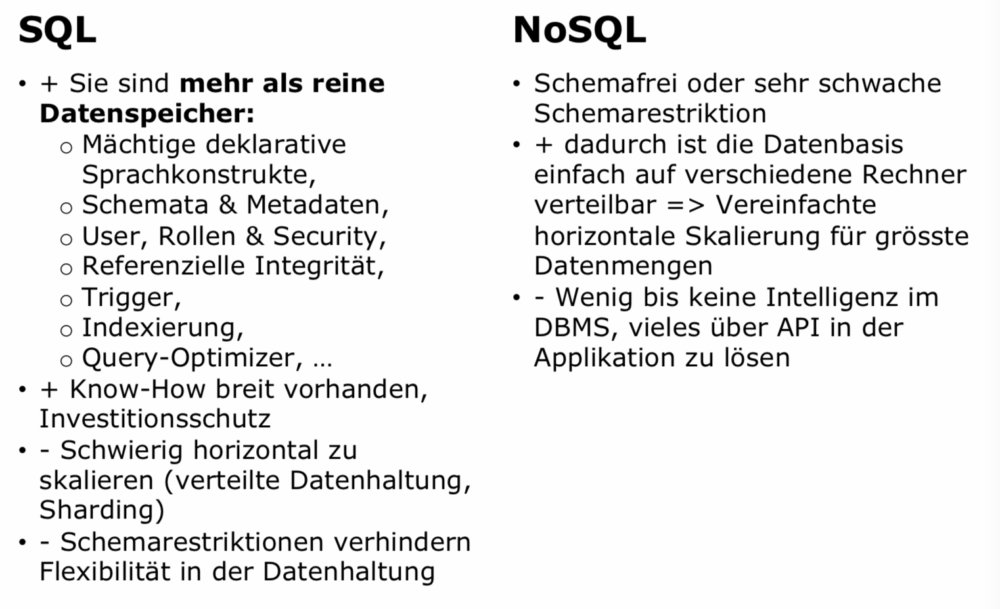
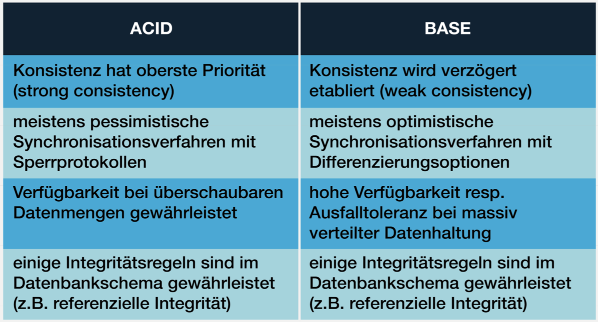

# NoSQL Databases

## Lernziele

### Den Zusammenhang von Big Data und NoSQL erklären

SQL Datenbanken sind nur sehr schwierig auf mehreren Rechner verteilbar (Sharding, Partitioning, horizontal Scaling).
Der Grund dafür sind Schemarestriktionen (Tabellen, Foreign Keys, usw.).
NoSQL löst dieses Problem, indiem Schemafreiheit oder schwache Schemas erlaubt werden.
Dies erlaubt einfaches Partitioning.

### NoSQL-Datenbanken definieren

Eine NoSQL-Datenbank weist folgende Eigenschaften auf:
- Das Datenmodell ist nicht relational
- Ausrichtung auf verteilte und horizontale Skalierbarkeit
- Schemafreiheit
- Einfache Datenreplikation
- Einfacher Zugriff über eine API
- Anderes Konsistenzmodell als ACID (z.B. BASE)

### Vor- und Nachteile von SQL im Verhältnis zu NoSQL-Datenbanken erklären

### Grund für die Entwicklung von NoSQL-Datenbanken und deren Eigenschaften (CAP, Base, Partitioning) erklären

Das CAP Theorem visualisiert:

Unterschied dem Konsistenzmodell ACID und BASE:

### Die Core NoSQL-Technologien erklären und ihre Unterschiede aufzeigen

Die Core NoSQL-Technologien sind:
- Schlüssel-Wert Datenbanken
- Dokumentdatenbanken
- Spaltenfamilien-Datenbanken
- Graphdatenbanken

**Schlüssel-Wert Datenbanken**  sind durch folgende Eigenschaften charakterisiert:
- Es gibt eine Menge von identifizierenden Datenobjekten, die Schlüssel
- Zu jedem Schlüssel gibt es genau ein assoziiertes deskriptives Datenobjekt, welches den Wert zum zugehörigen Schlüssel darstellt
- Mit der Angabe des Schlüssels kann der zugehörige Wert aus der Datenbank abgefragt werden

_Vorteil:_ durch Schemafreiheit beliebig horiziontal skalierbar, da die Daten sehr einfach partitionierbar (auf verschiedene Rechner verteilbar) sind.

**Column-Family Stores** sind durch folgende Eigenschaften charakterisiert:
- Daten werden in mehrdimensionalen Tabellen gespeichert
- Datenobjekte werden mit Zeilenschlüsseln adressiert
- Objekteigenschaften werden mit Spaltenschlüsseln adressiert
- Spalten der Tabelle werden zu Spaltenfamilien zusammengefasst
- Das Schema einer Tabelle bezieht sich ausschließlich auf Spaltenfamilien; innerhalb einer Spaltenfamilie können beliebige Spaltenschlüssel verwendet werden
- Bei verteilten, fragmentierten Architekturen werden Daten zu einer Spaltenfamilie physisch möglichst am gleichen Ort gespeichert (Ko- Lokation), um die Antwortzeiten zu optimieren

**Dokument-Datenbanken** sind durch folgende Eigenschaften charakterisiert:
- Sie ist eine Schlüssel-Wert Datenbank
- Die gespeicherten Datenobjekte als Werte zu den Schlüsseln werden Dokumente genannt; die Schlüssel dienen der Identifikation
- Die Dokumente enthalten Datenstrukturen in der Form von rekursiv verschachtelten Attribut-Wert-Paaren ohne referenzielle Integrität
- Diese Datenstrukturen sind schemafrei, d.h. in jedem Dokument können beliebige Attribute verwendet werden, ohne diese zuerst in einem Schema zu definieren

**Graphdatenbanken** sind durch folgende Eigenschaften charakterisiert:
- Die Daten oder das Schemaa werden als Graaph oder graphähnliche Strukturen abgebildet
- Datenmanipulationen werden als Graph-Transformationen ausgedrückt, oder als Operationen, welche direkt typische Eigenschaften von Graphen ansprechen (z.B. Pfade, Nachbarschaften, Subgraphen, Zusammenhänge, etc.)
- Die Datenbank unterstützt die Prüfung von Integritätsbedingungen, welche die Datenkonsistenz sicherstellt. Die Definition von Konsistenz bezieht sich direkt auf Graph-Strukturen (z.B. Knoten- und Kantentypen, und Attribut-Wertebereiche, referenzielle Integrität der Kanten)
