# 09 - Vertiefung ITIL-Prozesse

[TOC]

# Stoffabgrenzung

* Sie kennen ITIL Vers. 3 und dessen Phasenmodell und Prozessgruppen
* Sie kennen und verstehen die wichtigsten IT-Betriebsprozesse aus ITIL V3 und deren Bedeutung für das Unternehmen.
* Sie kennen folgende ITIL-Prozesse vertieft:
  * Continual Service Improvement
  * Service Asset & Configuration Mgmt.
  * Change Mgmt.
  * Software Deployment
  * Incident Mgmt
* Die ausgewählten und als Experte bearbeiteten IT-Betriebsprozesse aus der Testatübung gehören dazu.
* Die zu den vertieften Prozessen zugehörigen Kapitel im Buch ITIL V3 gehören auch zum Prüfungsstoff.

# Einführung

## ITIL v3

- Good Practice Framework
- Öffentlich Zugänglich, seit Ende 80er Jahre entwickelt, besteht heute aus 5 Kern-"Büchern"
- ITIL beschreibt die Prozesse, die einen effektiven und effizienten Betrieb der gesamten IT-Infrastruktur ermöglichen

## Prozessgruppen

* ITILv3 basiert im Kern auf dem Service Lifecycle
* Der Service Lifecycle beschreibt den Lebenszyklus des IT-Services von der Erfassung der Anforderung über die Gestaltung, Implementierung und den Betrieb bis hin zur kontinuierlichen Anpassung der Servicequalität und letztlich der Außerbetriebnahme. Im Mittelpunkt steht also nicht mehr die Prozesse als solche, sondern der zu liefernde Service.

## Service Lifecycle

ITIL ist um den Service Lifecycle herum organisiert, welcher die Prozessgruppen beinhaltet. Die Prozessgruppen sind weiter unten beschrieben.

# Prozessgruppen im Überblick

## Phasenmodell

Der Service Lifecycle beinhaltet diese Phasen (Phasenmodell):

## Service Strategy

* Ausgangspunkt für alle Aktivitäten im Lifecycle
* Führt ITSM als organisatorische Fähigkeit und deren strategischen Wert
* Ausrichtung von Business und IT
* Ziele identifizieren, neue Chances und Möglichkeiten neuer IT Services
* Kosten & Risiken des Service Portfolio betrachen

### Wichtige Fragen

 * Welche Services sollen wem angeboten werden?
 * Wie unterscheiden wir uns vom Wettbewerb?
 * Wie erzeugen wir echten Nutzen für unsere Kunden?
 * Wie definieren wir Servicequalität?
 * Wie finden wir den richtigen Weg zur Serviceoptimierung?
 * Wie gestalten wir die Services wirtschaftlich?

### Prozesse

 * Strategy Management for IT-Services
 * Service Portfolio Management
 * Financial Management
 * Demand Management
 * Business Relationship Management

## Service Design

Beschreibt den Entwurf und Entwicklung von IT Services.

Aktivitäten:

* Planung und Gestaltung neuer und veränderter Services
* Service-Management-Systeme und Tools, wie Service Portfolio und Servicekatalog
* Planung und Gestaltung von Technologie und Architektur
* Planung und Gestaltung der benötigten Prozesse
* Planung und Gestaltung von Messmethoden und Metriken

### Prozesse

* Design Coordination
* Service Catalogue Management
* Service Level Management
* Availability Management
* Capacity Management
* Information Security Management
* IT Service Continuity Management
* Supplier Management

## Service Transition

Beschreibt kontrollierte Überführung von neuen und geänderten IT-Services in den IT-Betrieb:

* Stellt eine Anleitung und Prozessaktivitäten für den Übergang der Services in die Business-Umgebung bereit
* Behandelt auch Themen wie Veränderungen der Unternehmenskultur, Wissens- und Risikomanagement

### Wichtige Aufgaben und Ziele sind:
 * Erkennen und Steuern der Kundenerwartungen bezüglich neuer und geänderter Services.
 * Übereinstimmung neuer oder geänderter Services mit den in den Service Requirements spezifizierten Anforderungen und Sachzwängen
 * Integration neuer oder geänderter Services in den BusinessProzess des Kunden
 * Serviceveränderungen werden in Bezug auf Kosten, Zeit und Qualität überwacht und gesteuert
 * Die effektive Umsetzung der definierten Servicestrategie in den Betrieb der Services ist sichergestellt

### Prozesse

 * Transition Planning & Support
 * Change Management
 * Service Asset & Configuration Mgmt.
 * Release & Deployment Management (*Installation, Software verteilen etc.*)
 * Service Validation & Testing (*Produktionstest, im Verbund mit anderen Services testen*)
 * Change Evaluation (*"Qualitätsmanagement des Service Transition"*)
 * Knowledge Management

## Service Operation

Beschreibt den effizienten und effektiven **Betrieb**, **Support** und **Unterhalt** der IT-Services

### Aufgaben und Ziele

Monitoring und Reporting zur optimierten Entscheidungsfindung
beim Steuern von Verfügbarkeit, Nachfrage, Kapazität und aller
weiteren Belange des Betriebs
• Sammeln und Bereitstellen von Informationen, Rückmeldungen
und Ideen als Basis für den kontinuierlichen
Verbesserungsprozess
• Sicherstellen der Verfügbarkeit und Stabilität der Services
• Bearbeiten und Beseitigen von Incidents und Problems

### Prozesse

* Event Management (Monitoring)
* Incident Management
* Problem Management *(Probleme, die immer wieder auftreten)*
* Request Fullfilment *(Benutzeranfragen erledigen, z.B. Könnt ihr mir ein File restoren)*
* Access Management *(AuthZ)*

### Funktionen

Sind nicht Prozesse; sondern OEs - diese verwenden die oben geführten Prozessen.

* Service Desk
* Technical Management
* IT-Operations Management
* Application Management

### Zielkonflikte Service Operation

Ein Serviceprovider muss den IT-Betrieb so ausrichten, dass er eine akzeptierte Balance zwischen Stabilität und Reaktionsfähigkeit findet.

## Continual Service Improvement

> Continual Service Improvement (CSI) ist im Kern ein Qualitätsmanagement für die angebotenen Services und die Service Management Prozesse.

Qualitätsmanagement für die Service Management Prozesse

### Ziel

Die Effektivität und Effizienz der IT-Services und der Service Mgmt. Prozesse kontinuierlich zu verbessern.

Folgende Voraussetzungen müssen erfüllt sein:
• Die Ergebnisse des Service Level Mgmt. sind betrachtet und analysiert.
• Benötigte Anpassungen zur Verbesserung der IT-Servicequalität
sowie der Prozesseffizienz und -effektivität sind identifiziert und
implementiert.
• Die Balance zwischen wirtschaftlicher Erbringung der IT-Services und
Kundenzufriedenheit ist gewährleistet und wird ständig verbessert.

### Prozesse

CSI hat genau 1 Prozess:

- 7-Step Service Improment

### Methoden

- Service Reporting
- Service Measurement

### "Demming" Zyklus

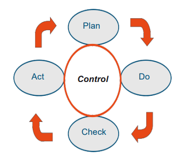

- **Plan**: Ziele & Massnahmen erstellen, Rollen und Verantwortlichkeiten definieren
- **Do**: Umsetzung und Dokumentation
- **Check**: Messdaten erhoben und in Reports zusammengefasst
- **Act**: Abweichungen identifizieren, Korrekturmassnahmen, Input für neue Planungsphase (**Plan**)
- **Control**:  Erstreckt sich über alle Phasen, stellt sicher dass die definierten Aufgaben und Aktivitäten sowie Ergebnisse dokumentiert werden

### 7-Step Prozess

"Aufgeblasener Demming Zyklus"

**Könnte Prüfungsrelevant sein**

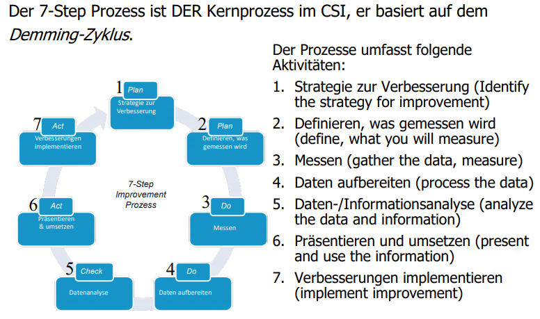

### Methoden des CSI

#### Service Measurement

- Notwendig, IT-Services strukturiert messen
- 2 Aspekte: Verfügbarkeit, Performance (Antwortzeiten)
  - Wichtig: End2End Betrachtung

#### Service Reporting

- Reporting; Pro Service - Aussage über Performance und Verfügbarkeit
- Empfänger: Business, IT-Management, IT-interne Stellen

### KPI

Reifegrad (0 - 5)

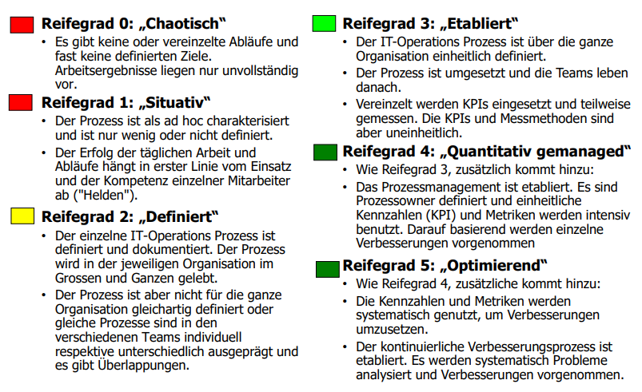

# ITIL-Prozesse

## Prozess: Service Asset & Configuration Management

> Das Service Asset und Konfiguration Management (SACM) hilft den Überblick darüber zu behalten, welches Equipment vorhanden ist, wo es ist und wofür es verwendet wird.

* Konfiguration Management ist mehr als Asset Management – es legt ein logisches Abbild der (relevanten)   IT und ihrer Beziehungen an
* Es ist die zentrale Basis für alle IT-Betriebsprozesse und deren Automatisierung
* Stellt in Zusammenarbeit mit dem Change Management sicher, dass Einträge richtig und aktuell sind
* Hilft bei der schnellen Problemlösung durch besseres Verständnis der Infrastruktur

### Ziel & Zweck

Bereitstellung von aktuellen und konsistenten Informationen
- zur Konfiguration der IT-Infrastruktur
  und
- über alle zur Service-Erbringung benötigten Komponenten

### Configuration Management - Definition

* Verwaltung IT-Metadaten
* Umfasst **alle** IT-Objekte (administrative Informationen wie z.B. Pikett-Team / Verantwortliche, + [...] todo)
* Stellt Datenqualität sicher

SACM Prozess:

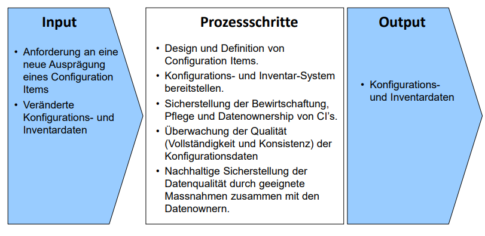

### Terminologie

#### CI - Configuration Item

> Ein CI ist eine IT-Komponente, welche unter der Kontrolle des Configuration Managements steht. Alle CIs stehen unter der Kontrolle des Change
> Managements. 

Diese können wie folgt klassifiziert werden:
- Hardware
- Software
- Dokumente
- Verträge
- Konfigurationen
- Beziehungen SW und HW
- Software-Konfiguration (SW- und Instanz-bezogen)
- IT-Services
- Gebäude 

Je nach Typ werden unterschiedliche Informationen zur betreffenden
Konfigurationseinheit benötigt und unterschiedliche Anforderungen gestellt.
Typische Attribute sind:
 Eindeutige Bezeichnung
 CI-Typ (HW, SW, etc.)
 Name
 Beschreibung
 Version
 Hersteller
 Status (in Betrieb, defekt, …)
 Beziehungen zu anderen CI (Abhängigkeiten)
 Owner
Hardware wird Beispielsweise in vielen Unternehmen mit einer eindeutigen
**Inventarnummer** versehen. Ein Gerät oder eine Komponente kann dadurch
schnell identifiziert werden. Neben den üblichen Bezeichnungen des Gerätes
und der Kategorie (PC, Drucker, Monitor) gehören auch geräte-spezifische
Informationen dazu.

#### CMDB / CMS

* Applikation, welche die Daten verwaltet
* Die CMDB verwaltet Daten, die in mehr als einem Systems Management Bereich
  bzw. mehr als einem Prozess benutzt werden, in einer (möglicherweise
  föderierten) Datenbank und stellt diese Daten über definierte Schnittstellen zur
  Verfügung.
* Diese Configuration Management Database (CMDB) ermöglicht eine prozess- und
  werkzeugübergreifende Informationsverarbeitung. Erst die integrative
  Beschreibung der Datenbestände und die Verknüpfung der Dateninseln
  ermöglichen durchgängige Betriebsprozesse.
* Wesentliche Funktionen sind:
  - Verwaltung Konfigurationseinheiten (CIs)
  - Versionierung sämtlicher Komponenten
  - Beschreibung des Zusammenspiels der einzelnen Komponenten, z.B. SW und Rechner
  - Journalisierung/Historisierung sämtlicher Änderungen auf Personen-Ebene 

#### Aufgabe 1

In einem Asset- & Configuration System werden Hardware und Software «typisiert», sprich die einzelnen Geräte und auch die Software werden in Haupt- und Unterkategorien unterteilt, z.B. «Server» (Hauptkategorie) und «Linux», «Wintel» und «HP-UX» (Unterkategorie).

Hardware:

* Server
  * Intel
  * Solaris
  * ...
* Mainframe
* Client
  * Desktop
  * Laptop
* ...

Software:

* Base
  * OS
  * Directory SW
  * Security SW
  * ...
* Middleware
  * DBMS
  * Webserver
  * Appserver
  * ...
* Application
  * Büro-Appl
  * Business-Appl

### Rollen

#### Configuration Manager (Process Owner)

Der Configuration Manager ist als Process Owner ganzheitlich für den Erfolg des
Configuration Management verantwortlich. Zu den Verantwortlichkeiten zählen:
 Planung und Überwachung der Aktivitäten im Configuration Management
 Definition und Pflege von Schnittstellen zu anderen Prozessen, z.B.
Change Management
 Überwachung und Sicherstellung der Datenqualität
 Tool-Evaluierung und Auswahl für das CMS
 Definition eindeutiger Konventionen für Configuration Items (z. B.
Namenskonventionen, CI-Typen, Versionen, Templates)
 Pflege und Aktualisierung des CMS
 Reporting an andere Prozesse und an das Management

#### Configuration Administrator

Inhaber dieser Rolle sind verantwortlich für
 die Durchführung der Pflegeaktivitäten im Service Asset and Configuration
Management sowie
 für die Bereitstellung der Informationen und des Status der gespeicherten CI.
 Sie unterstützen den Configuration Manager bei der Pflege des Service-Asset-andConfiguration-Management-Planes

#### Datenverantwortlicher / Data Owner

Die Daten werden an der Quelle aufgrund klar definierter Rollen und Autorisierungen
erfasst. Für jede Entität ist ein Datenverantwortlicher bestimmt, der die Daten im Rahmen
eines definierten Prozesses pflegt. Mehrfacherfassungen werden dadurch vermieden.

#### CMS Tools-Administrator

Der CMS/Tools-Administrator ist verantwortlich für die Funktionsfähigkeit und Weiterentwicklung des CMS und die anforderungsgerechte Konfiguration der eingesetzten Tools.

### KPI

Folgende KPIs sind für das CM relevant:

* Dimension Qualität:
  * Datenaktualität und –qualität der Konfigurationsdaten
  * Anteil erfolgloser RFC aufgrund falscher oder fehlender Informationen aus dem CMS
  * Quote genutzter Lizenzen in Bezug zu gekauften Lizenzen
*  Dimension Wirtschaftlichkeit:
  * Stückkosten pro Konfigurationsitem für Erfassung und Pflege
* Dimension Leistung:
  * Verfügbarkeit: Soll-/Ist-Vergleich der geplanten und effektiven Zeiten

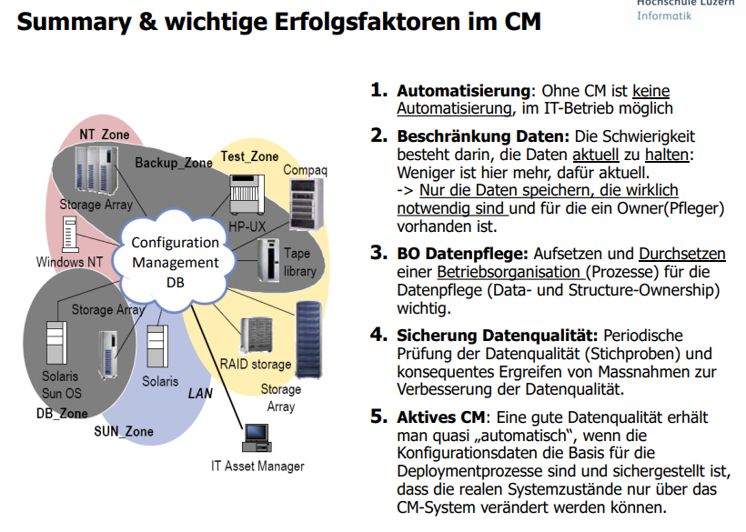

## Prozess: Change Management

CM kontrolliert:

* alle Veränderungen an vorhandenen Services
* das Hinzufügen von neuen Services
* die Ausserbetriebnahme von Services

### Ziele

1. Effiziente & effektive Durchführung von Changes
2. Negative Auswirkungen von Veränderungen auf Geschäftsprozesse minimieren
3. Störungen und Service-Unterbrechungen auf Grund von Changes reduzieren
4. Unnötige Nacharbeiten minimieren

Erweiterte Ziele:

1. Anforderungen aus Business & IT zur **Ausrichtung der Services auf die Geschäftsanforderungen** erfüllen
2. Changes in **angemessener Zeit durchführen**
3. **Dokumentation** aller Changes sicherstellen
4. Genehmigte Changes werden: priorisiert, geplant, getestet, implementiert und überprüft
5. Stellt sicher, dass **alle Änderungen** an Configuration Items im **Configuration Management System** dokumentiert sind
6. Risiken für das Business reduzieren

### Begriffe

* **Request for Change (RFC)**: Antrag zur Durchführung eines Service Change; Basis für die Bewertung, Planung und Genehmigung des Changes
* **Change Schedule (CS)**: Enthält alle genehmigten Changes inklusive des geplanten Datums der Implementierung
* **Change Model**:
  * Vordefinierte & dokumentierte Abläufe um Changes durchzuführen. Gemäss ITIL sollten folgende Elemente enthalten sein:
    * Arbeitsschritte und Umgang mit unvorhergesehenen Ereignissen
    * Zeitliche Reihenfolge der Arbeitsschritte
    * Verantwortlichkeiten während Durchführung
    * Zeitvorgaben & Schwellwerte, die zu einer Eskalation führen können
    * Vorgehensweise bei Eskalation
  * Change Arten:
    * Normale Changes
    * Standard Changes
    * Emergency Changes (SOS)
  * Standard Change ist das wohl am weitest verbreitete Change Model

### Standard Change

* Entlastet CM von unnötiger Bürokratie
* Für einfache, häufig wiederkehrende Changes mit überschaubarem Risiko
* Vom Change Management bewertet und **einmalig vorab genehmigt**
* Finanzielle Freigabe ist im Voraus erteilt oder liegt im Verantwortungsbereich des Antragstellers
* **Risiko niedrig** und immer **bekannt**
* Standard Change beinhaltet:
  * Bedingungen für Auslösung
  * Definiertes Startereignis (Trigger)
  * Detaillierte Beschreibung der für die Durchführung erforderlichen und bewährten Aktivitäten
  * Definierte Personen / Gruppen (z.B. Service Desk) für Durchführung
* **Beispiel**: Installation eines Arbeitsplatzes (Desktop / PC)

### Aufgaben

* **Kommunikation** mit den Beteiligten
* **Steuerung** der durchzuführenden Changes
* **Planung** der Changes (ab RFC bis Nachbearbeitung)
* **Zeitplanung** für die Change-Durchführung
* **Bewertung** der Changes bzgl. Risiken und Auswirkungen
* **Autorisierung** der Changes
* Erstellen von **Management Reports**

### Ablauf

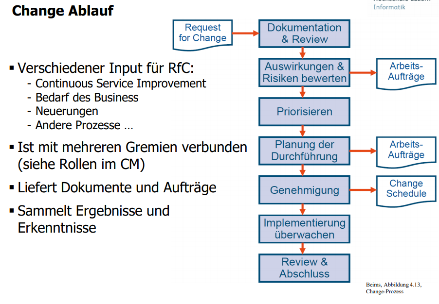

### Rollen

#### Change Manager

* **Steuert** Zielerreichung des Change-Management-Prozesses
* Verantwortet:
  * Zielerreichung des Change-Management-Prozesses
  * Annahme, Filterung, Dokumentation und Priorisierung der RFC
  * Einberufen des CAB ( Change Advisory Board) und Vorlage der relevanten Changes
  * Autorisieren der Changes, ggf. nach Abstimmung mit dem CAB
  * Bereitstellen der Change-Planung
  * Koordinieren der Change-Erstellung, der Tests und der Implementierung
  * Review aller implementierten Changes
  * Schließen der RFC nach Abschluss der Implementierung und des Review
  * Bereitstellen des Management Reportings

#### Change Advisory Board (CAB)
 * Changes bewerten, genehmigen und planen
 * Technische sowie Business-Sicht vertreten
 * Mitglieder: Kundenverteter, Spezialisten (Entwickler), Lieferanten, Anwendervertreter, Change Manager, Service Owner

#### Emergency CAB (ECAB)
 * Bei zeitkritischen Changes mit in der Regel hohen Auswirkungen
 * Muss kurzfristig erreichbar sein
 * Besitzt Autorität für notwendige Entscheidungen

### Herausforderungen

Die Ziele des CM:
 * Auswirkungen von Changes minimieren
 * Innovationsfähigkeiten zu erhalten

Dies führt zum Abwägen zwischen Flexibilität und Stabilität:

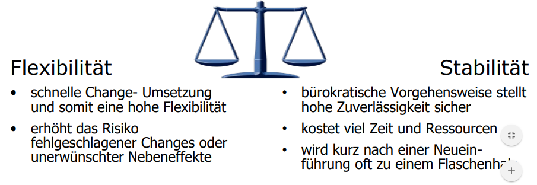

## Prozess: Software Deployment / Release Management

### Ziele

>  Erfolgreiche Integrationen von Releases in die geplante Zielumgebung unter Einhaltung der vorgegebenen Zeitplanung ohne Beeinträchtigung oder Störung des laufenden Betriebs.

### Build

Ein Build kann alles zusammenfassen:

* Änderungen, Ergänzungen, Neuerungen, Updates, Patches, Anpassungen dürfen nicht einfach ausgebreitet werden.
* Planung, Integration, Tests, Kundenvorbereitung und diverse Randbedingungen müssen feste und stabile  Umgebungen gewährleisten.

### Begriffe

* **Release Unit**:
  * Getestete und ausgerollte Einheit
  * Enthält Services, Applikationen und IT-Equipment, die Abhängigkeiten haben
  * Level wird von Geschäftsprozessen beinflusst
  * Kann relativ gross sein, gegenseitige Beeinflussung
* **Release Package**:
  * Kann aus mehreren Release Units bestehen
  * Definiert alle Veränderungen, um neue Baseline zu erreichen
  * Enthält auch Dokumente, Handbücher und Checklisten die zusammen benötigt werden
* **Release Cycle**:
  * Täglich, wöchentlich, monatlich etc.
  * Kann zu oft erfolgen, zu viele kleine Änderungen (kann nervig sein)

### Release- und Deployment-Modelle

Modelle haben folgende Informationen:

- Kriterien für Start und Ende eines Releases
- Release-Struktur (Gestaltung des Release Package und Informationen zur Zielumgebung)
- Beschreibt die Entwicklungs- und Testumgebungen, Rollen, Zeitpläne, Templates und Vorgaben für die Dokumentation sowie Übergabe- und Abnahmekriterien für die Durchführung

Optionen:

* **Big Bang**: Alles auf einmal; rasche Einführung; höheres Risiko für Fehler
* **Phased**: gestaffelt nach z.B. Standort, Funktion; Hoher Zeitbedarf, Learning von Phase zu Phase
* **Push**: Aktive Verteilung mit "Zwang"; Rasche Verteilung; Oft Benutzerbeeinträchtigung
* **Pull**: SW-Kiosk, evtl. fixer Endtermin, weniger Störungen des Benutzers durch Nutzung von Rand- oder Pausenzeiten

### Rollen

* **Release & Deployment Manager**
  * Verantwortet Steuerung aller Aspekte des kompletten Release-Prozesses, sowie:
  * Kommunikation während des Rollouts (Kundenzufriedenheit)
  * Aktualisierung von Service Knowledge Management System (SKMS) sowie Configuration Management System (CMS) bei Implementierung
  * Gestaltung & Betrieb der Testumgebung
  * Rollout-Planung
  * Einhaltung von Richtlinien & Release-Prozessen
  * Design, Erstellung und Konfiguration der Releases
  * Testdurchführungen und Erfüllung der Akzeptanzkriterien
  * Freigabe für die Implementierung
* **Release Packaging & Build Manager**
  * Zusammenstellung & Funktion eines Releases
  * Finale Tests eines Releases
  * Dokumentation der Ereignisse sowie ggf. Known-Errors und Workarounds innerhalb eines Releases
  * Informationen für die Release-Freigabe

### KPI

Was bewirkten KPIs im R&D?

* Verbesserung Kundenzufriedenheit bzgl. gelieferter Srevices
* Termintreue bei Implementierung neuer Services
* Weniger Unterbrüchen an den Services aufgrund Releases
* Weniger Fehler bei der Release-Planung
* Weniger Nachbesserungen pro Release

### Herausforderungen

Schnittstelle zum Change Management:

* nur ein **klar definiertes Ziel** des Rollouts und
* die **genau bekannten Erwartungen** des Kunden ermöglichen,
* einen **perfekt gestalteten Release-Management Prozess** und
* einen Service auszurollen, der den Kunden **zufriedenstellt**

Unklare Voraussetzungen oder Erwartungen machen eine genaue Zielerfüllung unmöglich!

## Prozess: Incident Management

### Ziele

> *Incident Management* verwaltet alle Incidents über ihren gesamten Lebenszyklus.  Das primäre Ziel dieses ITIL-Prozess besteht darin, einen IT Service für den Anwender so schnell wie möglich wieder herzustellen (Beims)

- Auswirkungen von Störungen auf die Geschäftsprozesse verringern
- Servicequalität und Verfügbarkeit einhalten
- Steigerung der Produktivität der Anwender

### Rollen

#### Incident Manager

Der Incident Manager ist verantwortlich für einen funktionierenden Prozess und stellt sicher, dass die Aktivitäten innerhalb dieses Prozesses effektiv und effizient erfolgen. Weitere Aufgaben des Incident Managers:

* Erstellung und Weiterentwicklung des Incident-Management-Prozesses
* Verantwortung für Auswahl und Integration benötigter Werkzeuge
* Management Reporting
* Steuerung des Beitrages der am Incident-Management-Prozess beteiligten Support-Teams (1st Line, 2nd Line…)
* Überwachung der Effektivität des Prozesses und Ableiten von Vorschlägen zur kontinuierlichen Verbesserung
* Steuerung der Durchführung von Major Incidents
* Eskalationsinstanz für die beteiligten Mitarbeiter

(aus Beims übernommen)

#### 1st Line Support (Service Desk)

Diese Rolle ist verantwortlich für die Bereitstellung des 1st Line Support durch die **Annahme** und **Bearbeitung von Anrufen und Meldungen** entsprechend den in den Prozessen Incident Management und Request Fulfilment definierten Aktivitäten.

(aus Beims übernommen)

#### 2nd Line Support

Die **Spezialisten** und Teams der Fachgruppen, die über ausgeprägte **Fachkenntnisse** zu einem bestimmten Thema verfügen, übernehmen die Rolle des 2nd Line Support und sind die Adressaten der ersten Stufe einer funktionalen Eskalation. Sie bearbeiten die weitergeleiteten Tickets gemäß entsprechenden Vereinbarungen in Operational Level Agreements.

(aus Beims übernommen)

#### 3rd Line Support

Auf der Ebene des 3rd Line Support werden weiter spezialisierte Teams zur Bearbeitung der Tickets hinzugezogen. Je nach Aufbau der Organisation und Gestaltung des 2nd Line Support kann es sich hierbei um Fachteams aus den Funktionen Technical- und Application Management handeln. In den meisten Unternehmen wird der 3rd Line Support jedoch bereits vom externen Dienstleister oder vom jeweiligen Hersteller durchgeführt.

(aus Beims übernommen)

### KPI

Einige Beispiele für mögliche Kennzahlen, mit deren Hilfe sich die Prozessqualität und der Beitrag zu den IT-Zielen messen lassen:

* Incidents je Arbeitsschritt (erfasst, in Arbeit, geschlossen)
* Größe des aktuellen Backlogs (absolut oder prozentual)
* Anzahl Major Incidents/Anzahl Incidents
* Anteil der innerhalb der SLAs behobenen Störungen
* Durchschnittliche Kosten pro Incident
* Anteil der Incidents, die erneut geöffnet wurden
* Anteil falsch kategorisierter oder falsch zugewiesener Incidents
* Erstlösungsrate
* Anteil der Incidents, die remote behoben werden konnten
* Aufschlüsselung der Incidents nach Arbeitszeiten

(aus Beims übernommen)

### Herausforderungen

* Zeit bis man einen Incident entdeckt (umso früher, umso besser). Am besten noch bevor die Anwender die Störung bemerken, beispielsweise mittels Monitoring.
* Ein funktionierender Event Management Prozess muss Ereignisse & Meldungen filtern und mögliche Incidents identifizieren. Die **Schnittstelle** zwischen Event- und Incident Management ist somit sehr wichtig.
* Informationen aus Problem Management, insb. Known Errors und Workarounds, müssen zur Verfügung stehen. Dies ermöglicht es Support-Mitarbeitern, aus vergangenen Incidents zu lernen und die bereits ausgearbeitet Workarounds anzuwenden.
* Configuration Management System sollte sinnvollerweise eingebunden werden. Somit können Configuration Items (CI), welche zu einem Service gehören, automatisch in Beziehung gebracht werden. Wichtig für die Priorisierung des Incidents.
* Kenntnis der SLA ist wichtig für die Priorisierung des Incidents.

### Aktivitäten (Input für Support)

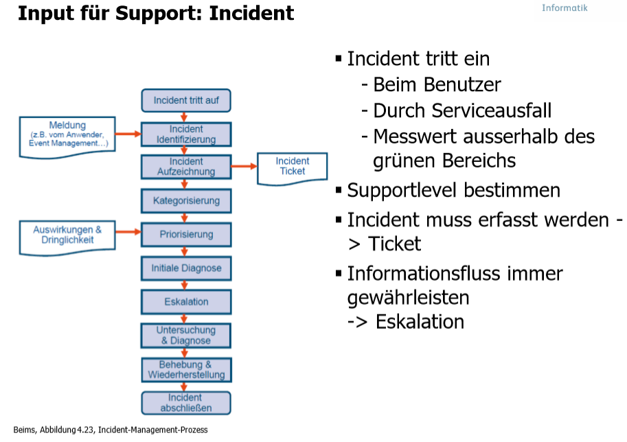

### Support Levels

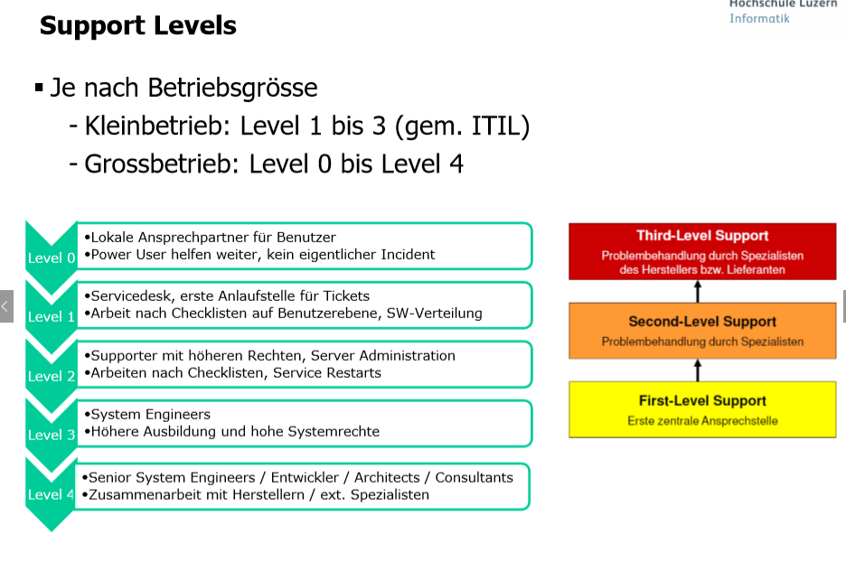

### Support Eskalation

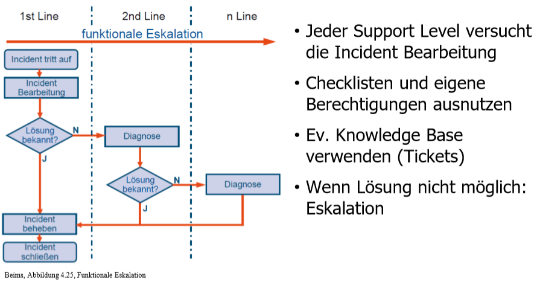

### Priorisierung

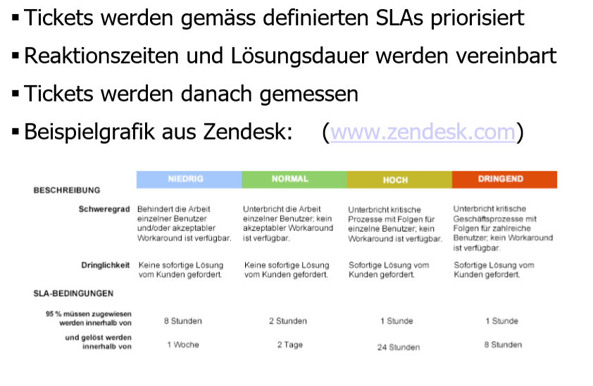

## Prozess: Availability Management

### Ziel und Kontext

- Prozess aus Service Design
- Alle mit dem Kunden vereinbarten Services werden im Availability Management in Verfügbarkeitsniveaus eingeteilt. 
- Der Hauptfokus richtet sich auf adäquate Planung und Realisierung künftiger Serviceanforderungen.
- Das Availability Management versteht sich als zentrale Anlaufstelle aller Fachbereiche bei der Ausgestaltung der Serviceverfügbarkeit. 

### Rollen

Availability Manager 

- trägt die Prozessverantwortung bezüglich Zuverlässigkeit, Wartbarkeit und Servicefähigkeit gegenüber dem Kunden. 
- Der Availability Manager stützt sich dabei auf protokollierte Indikatoren aus dem AMIS

→ Das Availability Management Information System (AMIS) ist Bestandteil des Service Knowledge Management.

### Begriffe

|                                   |                                                              |
| --------------------------------- | ------------------------------------------------------------ |
| Zuverlässigkeit (Reliability)     | Beschreibt die Fähigkeit eines Service oder einer Komponente, eine vereinbarte Funktion ohne Unterbrechung zu liefern. |
|                                   |                                                              |
| Wartbarkeit (Maintainability)     | Wartbarkeit beschreibt, wie groß der Aufwand ist, eine Komponente oder einen Service zu betreiben. |
|                                   |                                                              |
| Servicefähigkeit (Serviceability) | Beschreibung der Fähigkeit eines externen Providers, die vertraglich vereinbarten Leistungen für die bereitgestellten Services oder Komponenten zu erbringen. |

Begriffe zur Verfügbarkeit

|           |                                                              |
| --------- | ------------------------------------------------------------ |
| MTRS/MTTR | Meantime To Restore Service oder Mean Time to Repair “Downtime” ist die durchschnittliche (nicht garantierte) Reparaturzeit zur Behebung einer Störung. |
|           |                                                              |
| MTBF      | Mean Time Between Failures, oft auch „Uptime“ genannt, beschreibt die durchschnittliche Zeit, in der ein Service verfügbar ist. |
|           |                                                              |
| MTBSI     | Mean Time Between System Incidents, beschreibt die durchschnittliche Zeit zwischen dem Auftreten zweier Incidents, mit Betrachtung der Reparatur und Wiederherstellungszeiten. |

Begriffe zum Verfügbarkeitsniveaus

|                         |                                                              |
| ----------------------- | ------------------------------------------------------------ |
| High Availability       | Mittels Redundanzen erreicht man hohe Verfügbarkeit          |
|                         |                                                              |
| Fault Tolerance         | Korrekte Funktion eines Service trotz eines Komponentenausfalls - z.B. durch Workaround |
|                         |                                                              |
| Continuous Operation    | Gezielte Massnahmen, um die geplante Downtime eines Service trotz notwendiger Wartung zu reduzieren - z.B. Continuity Management gewisser Services von RZ auf Failover RZ |
|                         |                                                              |
| Continuous Availability | Ansatz zur Annäherung an eine 100 %-Verfügbarkeit durch die Kombination unterschiedlicher Massnahmen und Technologien - - z.B. Continuity Management von RZ auf Failover RZ |

### Aktivitäten

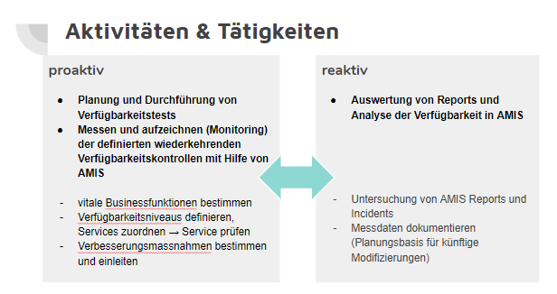

### Availability Plan

Enthält Ziele für die Gestaltung der Verfügbarkeit in Bezug zu den Geschäfsanforderungen und konkrete Massnahmen 

- Vergleich von vereinbarter Verfügbarkeit <=> tatsächlichen aktuellen Verfügbarkeit
- Verbesserung der Verfügbarkeit
- Entscheidungsvorlagen bezüglich Kosten und Nutzen
- Bewertung erwarteter Änderungen 
- Auswirkungen geplanter neuer Services auf Verfügbarkeit

### KPI

|                                                  |                                                              |
| ------------------------------------------------ | ------------------------------------------------------------ |
| Service-Verfügbarkeit                            | Verfügbarkeiten der IT-Services relativ zu den in den SLAs vereinbarten Verfügbarkeiten |
|                                                  |                                                              |
| Anzahl von Service-Unterbrechungen               | Anzahl von Unterbrechungen der IT-Services pro Zeitintervall |
|                                                  |                                                              |
| Dauer von Service-Unterbrechungen                | Durchschnittliche Dauer von Unterbrechungen der IT-Services  |
|                                                  |                                                              |
| Abdeckung der Verfügbarkeits-Überwachung         | Prozentsatz von Services und Infrastruktur-komponenten unter Verfügbarkeits-Überwachung |
|                                                  |                                                              |
| Anzahl implementierter Verfügbarkeits-Massnahmen | Anzahl der implementierten Massnahmen mit dem Ziel der Verfügbarkeits-Erhöhung |

## Prozess: Capacity Management

### Kontext

Die Service Design analysiert die Wünsche und Anforderungen der Kunden, und das Capacity Management ist in dieser Phase der kritische Erfolgsfaktor für die Definition eines IT-Service.

### Ziele

Sicherstellung, dass die IT-Kapazität auf **aktuelle** und **zukünftige Bedürfnisse** des Kunden zu vertretbaren Kosten **abdeckt**.

### Unterprozesse

| Businesss Capacity   Management       | Anforderungen in Spezifikationen für   den Service und die Infrastruktur umwandeln, mit   dem Fokus auch auf zukünftige Anforderungen. |
| ------------------------------------- | ------------------------------------------------------------ |
| Service Capacity   Management         | Identifiziert und verschafft sich einen fundierten Einblick   in die IT-Services (einschliesslich Design Patterns, Architektur,   usw.), um sie auf die definierten Ziele   abzustimmen. |
| Component Capacity   Management (CCM) | Managed, kontrolliert und prognostiziert die   Performance und Kapazität einzelner   Komponenten. |

### Aktivitäten

Proaktive Aktivitäten:

* Prognostizierung zukünftiger Anforderungen und Trends
* Budgetierung, Planung und Implementierung von Upgrades
* Suchen nach neuen Wegen, um Serviceleistungen zu verbessern
* Optimierung der Leistung eines Services

Reaktive Aktivitäten:

* Monitoring und Messungen durchführen

### Begriffe

Capacity-Plan

* Business Szenarien
* Prognose für die Service-Auslastung und Performance
* Prognose für die Ressourcen-Auslastung und Performance
* Andere portentielle Auswirkungen auf die Service-Kapazität und Performance
* Initiativen zur Anpassung von Service-Kapazitäten und Performance

CIMS: Capacity Management Information System

### KPI

| Vorfälle   aufgrund von Kapazitätsengpässen | Anzahl der Vorfälle, die   aufgrund unzureichender Service-   oder Komponentenkapazität auftreten |
| ------------------------------------------- | ------------------------------------------------------------ |
| Genauigkeit   der Kapazitätsprognose        | Abweichung der   prognostizierten Kapazitätsentwicklung vom tatsächlichen   Verlauf |
| Kapazitätsanpassungen                       | Anzahl der Anpassungen der   Service- und Komponentenkapazitäten aufgrund   veränderter Nachfrage |

| Ungeplante   Kapazitätsanpassungen      | Anzahl der ungeplanten   Erhöhungen der Service- oder Komponentenkapazität aufgrund   von Kapazitätsengpässen |
| --------------------------------------- | ------------------------------------------------------------ |
| Lösungszeit   bei Kapazitätsengpässen   | Lösungszeit für   identifizierte Kapazitätsengpässe          |
| Kapazitätsreserven                      | Prozentsatz der Kapazitätsreserven bei Normal-   und Maximalbedarf |
| Prozentsatz   der Kapazitätsüberwachung | Prozentsatz der Dienste   und   Infrastrukturkomponenten im Rahmen der Kapazitätsüberwachung |