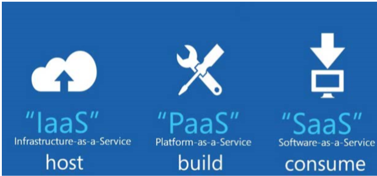
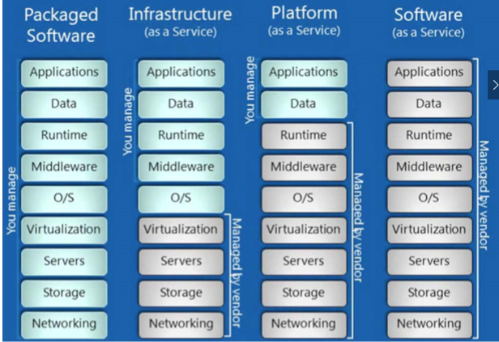

# 06 - Ressourcen-Management im Data Center

## Stoffabgrenzung

* Sie kennen die wichtigsten Schlagworte aus den virtualisierten Umgebungen und können diese erklären
* Sie können die Aufgaben im Management von virtuellen Umgebungen aufzeigen und erklären
* Sie können die Aufgaben der Systemadministrator-Rolle definieren
* Sie können die Einbindung des SysAdmins in ITIL aufzeigen
* Sie verstehen den neuen Begriff DevOps und deren Abbildung auf den IT-Betrieb

## Schlagworte: IaaS, PaaS, SaaS

## Management-Aufteilung

Anbieter und Anwender verwalten mehr oder weniger Schichten. Aufteilung durch:

* SLA
* Rechte
* Interface

## Management

### Ressourcen

* Messung der aktuellen Auslastung
* Vergleich mit den zur Verfügung stehenden Ressourcen
* Verteilnug von Lasten auf nicht ausgelastete Bereiche

DRM: Distributed Ressource Management, beispielsweise bei VMWare Clusters mit Automatismen

### Aufgaben

* Abbildung von ITIL auf den Betrieb
* Capacity Management (CPU, RAM, Netzwerk, Storage...)
* Ressourcen Management
  * IT-Staff, Skills, Deputies
  * Money, Space, Power, Cooling, Racks
  * Manufactures, Contractors, Supporters

## Sysadmin

* System-Operator oder Systemadministrator
* Alias:
  * Administrator, Admin, Sysadmin, Netzwerkadministrator, Netzwerkverwalter, Netzadministrator, Netzverwalter, Systemmanager, Systemverwalter, Systembetreuer, Operator, Sysop
* Systemadministratoren planen, installieren, konfigurieren und pflegen die IT-Infrastruktur eines Unternehmens oder einer Organisationen. Als Operatoren führen sie die zum täglichen Betrieb der Infrastruktur erforderlichen manuellen Tätigkeiten aus.
* In grösseren Organisationen können sich die Aufgaben auf ein ganzes Team erstrecken