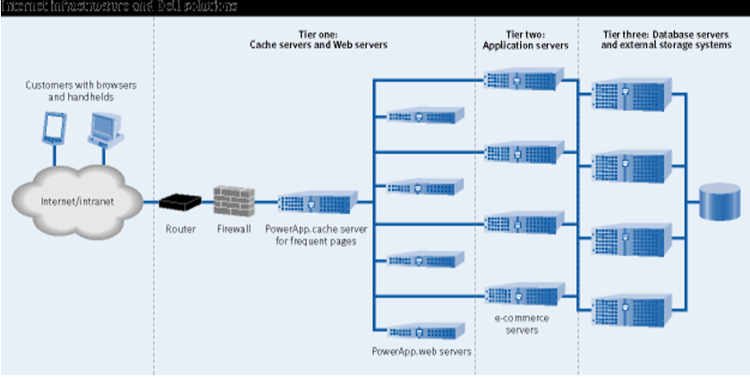

# 04 - Serversysteme & Storage im Data Center

## Stoffabgrenzung

* Sie kennen der verschiedenen Bauformen von Servern und Storage-Geräten.
* Sie können die Einsatzzwecke der verschiedenen Typen, Vor- und Nachteile der Geräte sowie die optimale Platz-Ausnutzung erklären.
* Sie kennen die Ausbaumöglichkeiten und Leistungsbereiche von Servern und Storage.
* Sie können spezifische Redundanzbereiche adressieren und technisch erklären.

## Bauformen

### Serversysteme

Leistung, Verwendungszweck, Erweiterungen und Kapazitäten bestimmen die Bauform.

Ausprägung je nach Verwendungszweck.

* Towergehäuse
  * ältere Serverräume
  * Kleine Anlagen in Räumen ohne Rack
* 19-Zoll Rackmount
  * Rack-optimiert, Standardgehäuse (1 bis x HE)
  * 1 HE = 1 U = 1.75 Zoll = 4.45 cm
  * Meist ausziehbar für die Wartung
  * Verkabelung auf Rückseite
  * Schwenkarm für Kabel
  * Luftführung vorne -> hinten
  * Hohe Packungsdichte
  * Gute Erweiterbarkeit
* Rackmount Server
* 1U für hohe Dichte
  * nur 1-2 Slots, Ausbau begrenzt
  * 1-2 Festplatteneinschübe
* 2U für Standardanwendungen
  * 2-8 Slots für Zusatzkarten
  * Leistungsstarke Prozessoren
  * Mittlere RAM-Grössen
  * 2-24 Festplatteneinschübe
* 3-6 U für High Performance Rechner
  * Viele Slots
  * 2-8 Prozessoren
  * Höchste RAM-Grössen
  * Bis 48 oder mehr Festplatten
* Blade Server
  * Höchste Dichte
  * Zentralisierte Komponenten
    * Power-Supplies
    * Management
    * Switches (LAN + FC)
  * Hot-Swap von ganzen Servern
  * Rip&Replace
    * Automatische Provisionierung
  * Flexibler Ausbau mit Switches
  * Alle Komponenten redundant und Hot-Swap
* Spezialserver (1U Appliances, oft dedizierte Server mit fixen Aufgaben)

### Storagesysteme

* Disk Subsystem
  * Lokale Speichererweiterung für Server
  * Direkt an Diskkontroller angehängt
* NAS: Speicher via Netzwerk verteilt, Zugriff via Webinterface, SMB/CIFS etc.
* Storage Server:
  * Spezialisiertes OS für Speicherverwaltung
  * Anbindung via Netzwerk, Share, SMB, NFS, ...
* Storage Arrays
  * Anschluss via SAS, FC, FCoE
  * Interne Intelligenz zur Blockverwaltung
  * Zentrale, redundante Controller

## Einsatzzwecke

* Einfache Dienste
  * Kleinere Rechenleistung, wenig Memory, lokale Disks
  * Webserver, Firewall, …
* Virtualisierungs-Plattform
  * Hohe Prozessorleistung
  * Viel Arbeitsspeicher
  * Zentrale Disks, SAN
* HPC High Performance Computing
  * Höchste Prozessordichte
  * Sehr viel Speicher
* Standalone DB Server
  * SAP als Beispiel mit Oracle-DB-Server oder Hadoop (Big Data)
  * InMemory DB Server (mehrere TB RAM)

## Ausbau & Leistungsbestimmungen

### Serversysteme

Welche Faktoren bestimmen die Leistung eines Servers?

- Anzahl HD-Slots
- Anzahl Steckplätze für Erweiterungen
  - Netzwerk
  - SSD / SATA / etc
- RAM Grösse
  - OnBoard
  - Raiser Cards (Modul für weitere RAM Slots)
- Anzahl CPUs: 1-8 CPU mit mehreren Cores, Taktrate, Cache

### Storagesysteme

* Speichererweiterung on the fly: HotPlug Disks, dynamische Arrays, Controller kann selber Daten neu verhalten (Erhalt der Raids und Verteilung auf alle Disks)
* Speichererweiterung mit neuer Technologie: SAS/FC zu SSD - migrieren von LUNs (=virtuelle Disks) auf schnelleren oder langsameren Speicher während Betrieb
* Einbau von Cache: Grosse Arrays haben zT grosse RAM-Speicher als Cache
* Mehr Shelfs / Controller

## Redundanzbereiche (RAID)

RAID = Redundant Array of independent disks

- RAID 0: Keine Redundanz, Zusammenschluss mehrerer Disks zu einem logischen Laufwerk. Mindestens zwei Festplatten benötigt.
- RAID 1: einfache Redundanz, Daten werden identisch auf zwei Festplatten geschrieben. Mindestens zwei Festplatten benötigt.
- RAID 5: verteiltes Speichern von Daten und Parity (Prüfbit). Mindestens drei Festplatten benötigt.
- RAID 6: Advanced Data Guarding (ADG), Parity immer auf zwei Festplatten, damit zwei Festplatten ohne Verlust ausfallen können. Mindestens vier Festplatten benötigt.