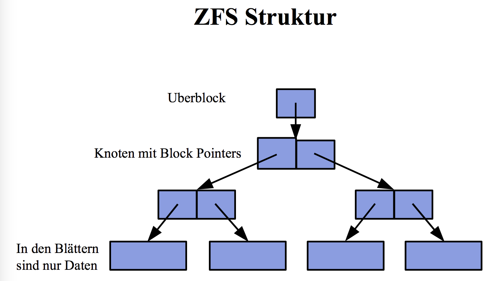
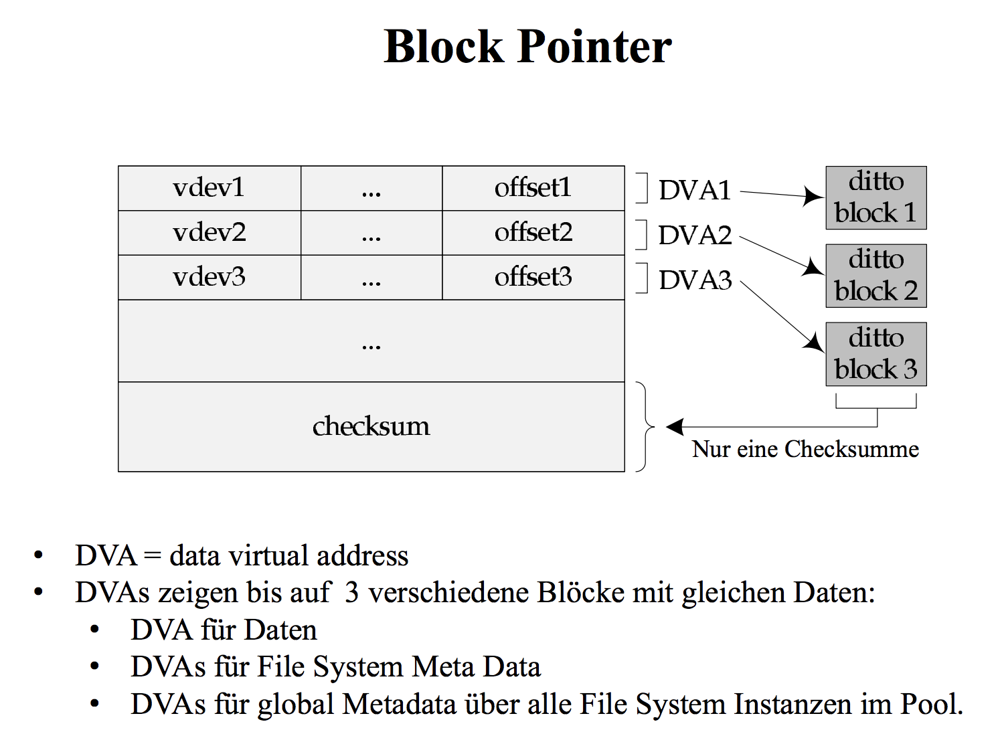
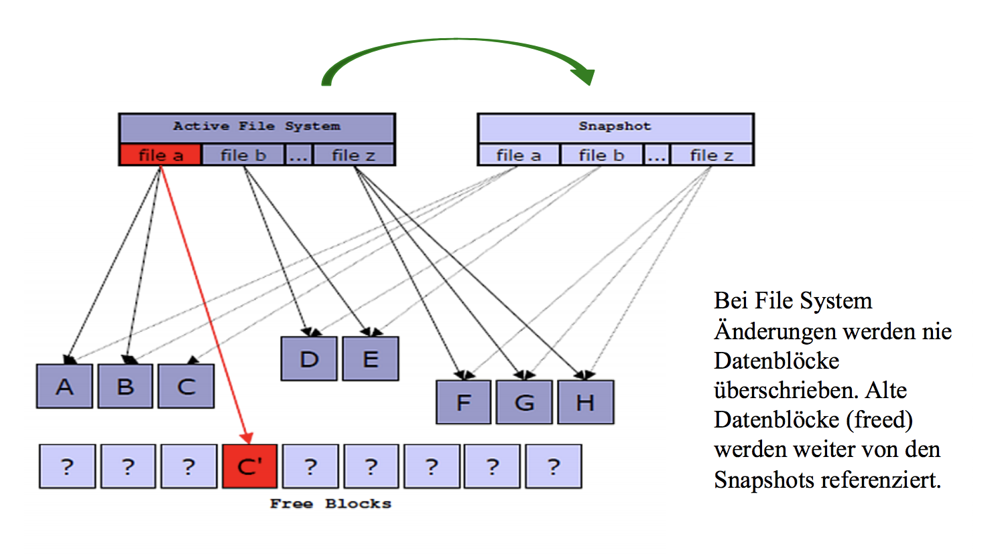
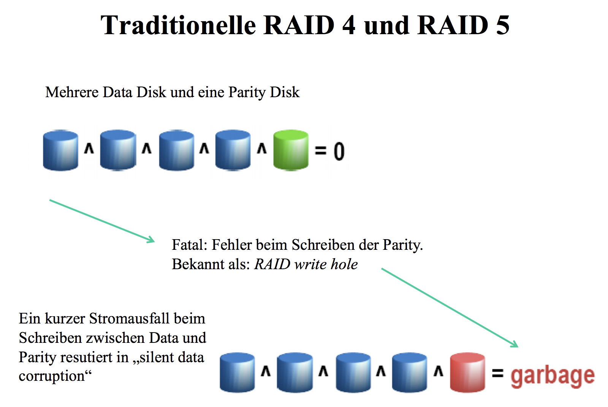

# Filesysteme

## Kontrollfragen
###  Was ist ein Buffer Cache?
Ein Buffer Cache ist ein Cache für Block Devices. Er beschleunigt den Blockzugriff (vom Kernel), da nur vom Device gelesen werden muss, wenn Blöcke nicht im Cache vorhanden sind. Der Datentransfer wird mittel DMA gemacht. Daher braucht er keine Prozessor Zyklen, sondern Bus Zyklen.

3 verkettete Listen werden gebraucht um den Buffer Cache zu unterhalten:
- Freie Liste: listet alle Plätze vom Cache die für den Gebrauch zur Verfügung stehen.
- Device Liste: listet alle Buffer die momentan mit einem FS verknüpft sind.
- Driver I/O Queue: listet die Buffer auf die bei einem bestimmten Device einen I/O ausführen oder auf einen I/O warten.

### Wie werden im zfs Volumes mit einem Filesystem darauf gebildet.

### Was ist neu im zfs I/O Stack?
Operationen sind atomisch und benötigen kein Journal. 

### Wie sieht die zfs Struktur aus?

[https://en.wikipedia.org/wiki/Merkle\_tree](https://en.wikipedia.org/wiki/Merkle_tree)

### Welche Informationen sind in einem Block Pointer enthalten?

[https://en.wikipedia.org/wiki/Inode](https://en.wikipedia.org/wiki/Inode)
[https://en.wikipedia.org/wiki/Inode\_pointer\_structure](https://en.wikipedia.org/wiki/Inode_pointer_structure)

### Wieviele Buffer Caches unterhält das VFS?
4 Caches:
- Page Cache
- Inode Cache
- Buffer Cache
- Directory Cache
[https://www.usenix.org/legacy/publications/library/proceedings/usenix01/full\_papers/kroeger/kroeger\_html/node8.html](https://www.usenix.org/legacy/publications/library/proceedings/usenix01/full_papers/kroeger/kroeger_html/node8.html)

### Erklären sie den Unterschied zwischen CoW (copy on write) und RoW (relocate on write)
**Copy on write**: Die alten Daten werden in einen neuen Speicherblock kopiert. Die Daten im alten Speicherblock werden überschrieben mit den neuen Daten. 

**Redirect on write**: Neue Schreibanfrage möchte die Daten in den alten Block schreiben. Diese werden aber in einen neuen Block geschrieben (redirect). Der Originalblock enthält alte Daten

###  Was sind Snapshot und wie funktionieren diese?

### Was versteht man unter einem „Erasure Code“?
[https://en.wikipedia.org/wiki/Erasure\_code](https://en.wikipedia.org/wiki/Erasure_code)

### Wozu eignen sich Snapshots nicht?
Sie eignen sich nicht für Backups, aber für Restores.