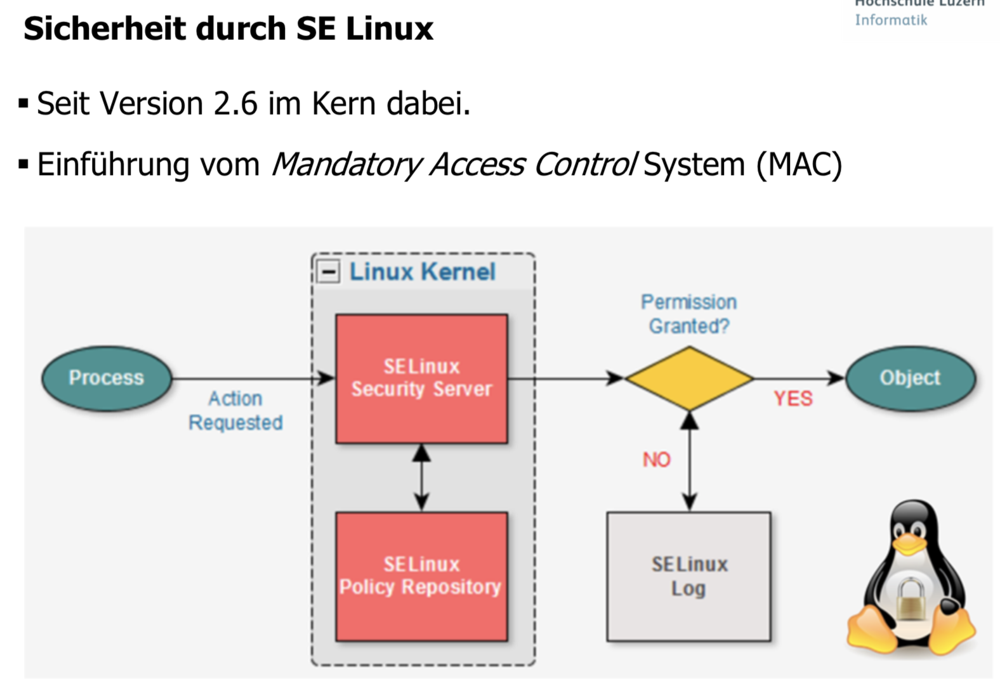
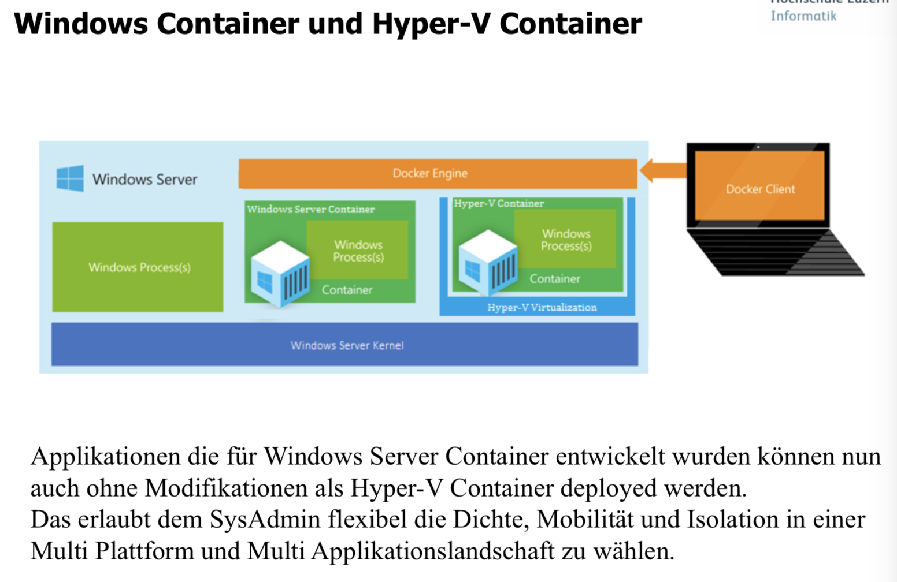
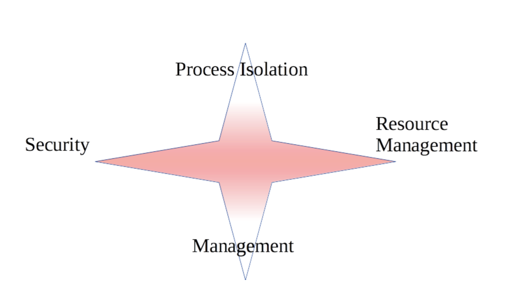
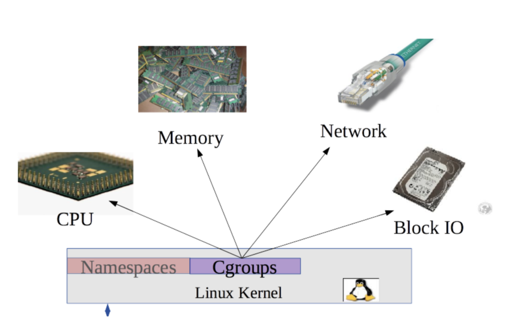
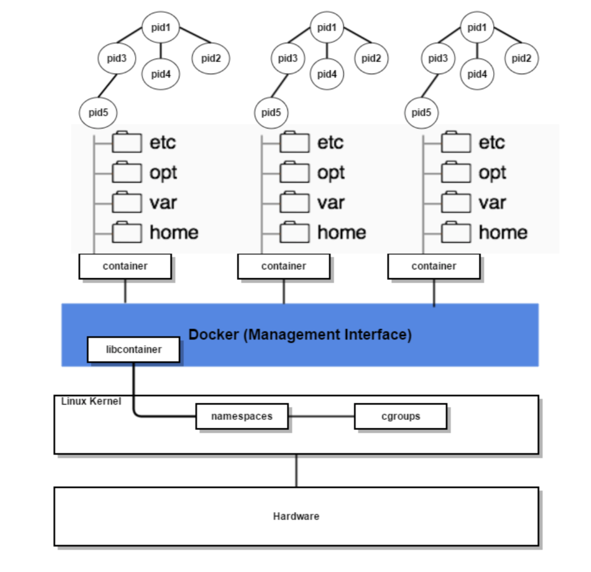
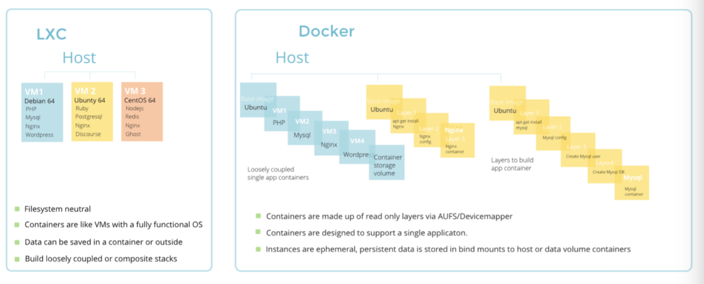
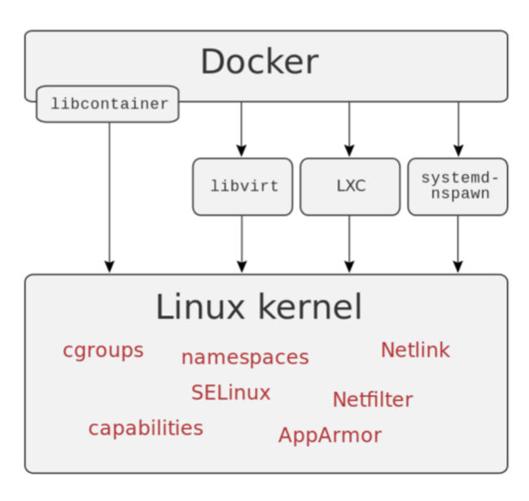
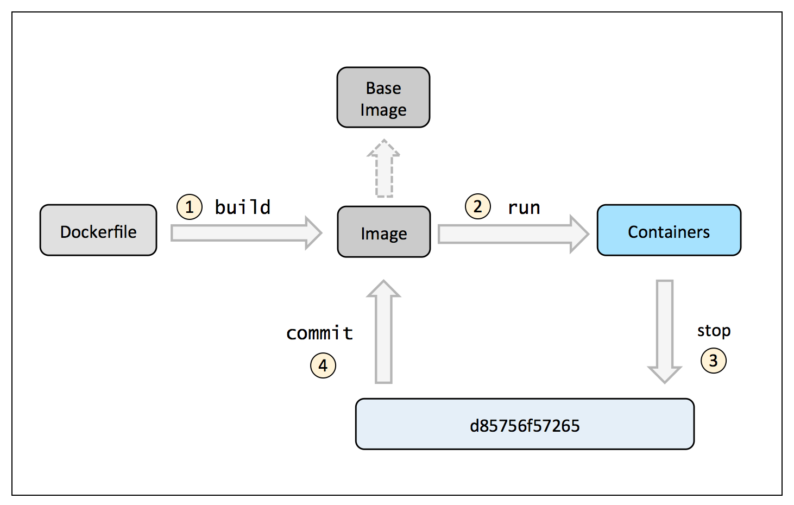

# Operating System Virtualisierung

##  Linux Subsysteme
- **blkio** setzt Limiten auf Input/Output Zugriffe auf Blöcke Geräte. cpu verwendet den Scheduler um cgroups Tasks die CPU Verwendung zu ermöglichen
- **cpuacct** generiert automatische Reports bez. CPU Verwendung. Diese werden von Tasks in einer cgroup verwendet.
- **cpuset** vergibt individuelle CPUs (in einem multicore System) und Memory an Tasks in einer cgroup.
- **devices** erlaubt/verhindert Zugriff von Tasks in einer cgroup auf Geräte.
- **freezer** suspends/resumes Tasks in einer cgroup.
- **memory** setzt Limiten auf Memory Verbrauch von Tasks in einer cgroup. Generiert automatische Reports dieser Memory Ressourcen
- **net\_cls** setzt Tags mit einer ID (classid) auf Netzwerkpackete welche dem Linux traffic controller (tc) erlaubt zu Erkennen welche Packete von einer bestimmten cgroup Task stammen.
- **net\_prio** setzt dynamisch Prioritäten auf Netzwerk Interfaces.
- **ns** — Das Namespace Subsystem

##  SE Linux

## Windows Container

## Kontrollfragen

### Wo ist die OS Virtualisierung im Bezug zu den anderen Server Virtualisierungen einzuordnen?

Im Unterschied zur Hardware Virtualisierung verwenden Container direkt den Kernel vom Host OS, nicht wie sonst mehrere Kerne. Sie ist leichtgewichtiger als die herkömmliche Hardware Virtualisierung und Hardware Partitionierung. Einerseits wird kein Hypervisor benötigt, somit sind auch Traps und Emulate nicht notwendig. Daher braucht man auch weniger zusätzliche Prozessorzyklen. 

### Wie nennt man eine Instanz eines virtuellen OS?

### Nennen sie Vor-/Nachteile einer viruellen OS Instanz

Vorteile:
- feingranulare Kontrolle über individuelle Prozesse und Anwendung
- erlaubt Isolation von Anwendungen
- transparente Migration von Anwendungen möglich, da nicht ganze OS Instanzen migriert werden müssen

Nachteile:
- Nur gleiche Operating Systems können virtualisiert werden (also kein Windows im Linux Kernel)
- Container müssen auf dem selben Patch Level laufen wie das Operating System/Kernel 
- Anforderungen an SysAdmin steigen (bei Hypervisor auch)
- Ressourcenmanagement muss (soll) in der Regel verwendet werden

### Versuchen sie die OS Virtualisierung als Blockschema zu zeichnen.

### Welche 3 Erweiterungen mussten im Linux vorgenommen werden um Linux Container erzeugen zu können?

- `chroot`
- `cgroups`
- `ns`
- `SE Linux`

### Erklären Sie den Unix Befehl chroot

`chroot` ist eine Operation die das root Directory für den aktuell laufenden Prozess und dessen Kinder ändert. Ein Programm das in diesem modifizierten Umfeldes läuft kann auf keine Dateien und Kommandos mehr ausserhalb dieses Verzeichnis Baumes zugreifen. Das modifizierte Umfeld nennt man chroot jail.

### Wozu wird bei der OS Virtualisierung cgroups gebraucht?

Erlauben das allozieren von Systemressourcen wie zB: CPU Zeit, System Memory, Netzwerkbandbreite oder eine Kombination davon über eine Benutzer definierte Gruppe von Tasks (Prozesse). cgroups erlauben dem Administrator eine feingranulare Kontrolle über die Zuordnung, Priorisierung, Verwaltung und Überwachung von Systemressourcen. HW Ressourcen können so aufgeteilt werden unter Benutzern und Tasks (Prozesse). 

### Erklären sie das cgroup Prozess Modell

cgroups sind wie Prozesse hierarchisch organisiert, wobei die Kinder die Attribute ihrer Eltern erben. Trotzdem gibt es zwischen den beiden Modellen Unterschiede.

Alle Prozesse im Linux System sind Kinder Prozesse von einem gemeinsamen Vater, dem init Prozess, welcher zur Bootzeit ausgeführt wird und andere Prozesse startet (welche ihrerseits wieder Kind-Prozesse erzeugen). Weil alle Prozesse von einem und demselben Vater abstammen ist das Linux/Unix Prozess Modell eine Mono-Hierarchie (oder Einzel Baum). Zusätzlich erbt ein Linux/Unix Prozess die Umgebung (zB. die PATH Variable) und bestimmte andere Attribute (zB File Deskriptoren) von seinem Vater Prozess.

Der fundamentale Unterschied besteht darin, dass viele verschiedene Hierarchien von cgroups simultan in einem System existieren können. Wenn das Linux/Unix Prozess Modell ein „single Tree“ von Prozessen ist, so ist das cgroups Modell ein oder mehrere separate, unabhängige Prozess Bäume. Weil jede Hierarchie an ein oder mehrere Subsysteme gebunden sind braucht es mehrere separate Hierarchien. Ein Subsystem repräsentiert eine einzelne Ressource wie zB CPU Zeit oder Memory. Es gibt im Linux einige solcher Subsysteme (vergl. nächste Folie).

### Wozu braucht es ein naming System um Linux Container erzeugen zu können?

Ein Namespace abstrahiert eine globale System Ressource in der Art, dass der zum Namensraum gehörende Prozess meint er besitze diese Ressource einzigartig. Änderungen an dieser globale Ressource sind nur sichtbar für die Mitglieder im gleichen Namensraum. Für andere Prozesse sind sie nicht sichtbar. Eine offensichtliche Verwendung von Namensräumen ist die Implementation von Containern.

### Zählen sie ein paar Linux Namespaces auf und erklären sie diese.

- **Mount namespaces** isolieren die FS mount Points wie sie von Prozessen gesehen werden. Prozesse in verschiedenen Namensräumen können so verschiedene Sichten auf die FS Hierarchie haben.
- **UTS namespaces** isolieren 2 System IDs. Node Name und Domainname. Das erlaubt jedem Container seinen eigenen Namen zu tragen.
- **IPC namespaces** isolieren gewisse Ressourcen für Inter Prozess Kommunikationen.
- **PID namespaces** isolieren den Prozess ID Nummernraum. So können Prozesse in verschiedenen Namensräumen die gleiche ID besitzen (zB jeder Container hat sein init PID 1).
- **Nework namespaces** isolieren die System Ressourcen welche in Verbindung mit dem Netzwerk stehen. So kann jeder Namensraum sein eigenes Netzwerk Interface haben.
- **User namespaces** isolieren den User und Gruppen ID Nummernraum. So kann ein Prozess innerhalb des Namensraumes volle Root Rechte ausserhalb jedoch keine Privilegien haben.

### Was ist Docker?

Docker ist eine Applications-Engine basierend auf Containern. Docker verwendet die Möglichkeiten von LXC um Applikationen innerhalb eines Container bereitzustellen. Solche „Container“ sind read only und hochgradig Portierbar. Ist ein SW Layer über dem Linux Container. Dockt an jedes Linux an und verwendet die vorher besprochenen Kern Erweiterungen (erzeugt eigenen Namespace und cgroups für die Applikation durch die Virtualisierungs-APIs und die mitgebrachte libcontainer Library).

Lifecycle:

