# Paralelle Architekturen

## Stoffabgrenzung

> Sie kennen die modernen Prozessorarchitekturen mit **SMT**, deren **Speicheranordnungen** und **Verbindungsnetzen** und können die **Cachekoherenzprobleme** und die Lösungsansätze dazu erklären.

## Verbindungsnetze

Vernetzung der Prozessoren. Zum Beispiel: 1000 Prozessoren benötigen 10^6 Verbindungen, jede z.B. 64 Bit breit - also 6,4 * 10^7 Leitungen. Bei einer 100-lagigen Platine wäre das eine Platinenbreite von ca. 6 km!

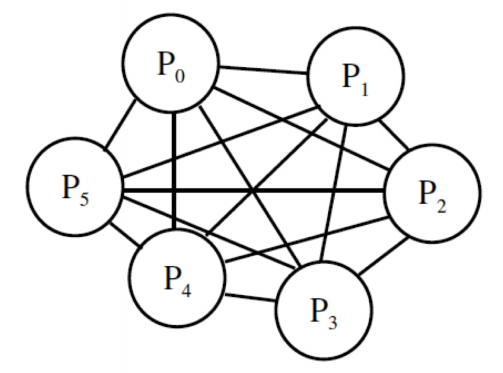

**Verbindungsnetzwerk**: Es ist nicht jeder Prozessor mit jedem verbunden, kann jedoch jeden erreichen.

### Entwurfskriterien

* hohe Leistung -> viele Leitungen
* niedrige Kosten -> wenig Leitungen

### Klassifikationskriterien

Topologie:

* Wie sind die Prozessoren miteinander verbunden (gemeinsames Medium vs. geschaltene Verbindungen)
* Statisch oder dynamisch veränder bar? (Verbindungen invariant vs. auf Anforderung etabliert)

Routing:
- Wie werden die Nachrichten verteilt (store and forward, wormhole, cut-trough, circuit switching, packet switching)?
- Welcher Algorithmus zur Pfadbestimmung wird verwendet (deterministisch, off-line, adaptiv, randomized)?

### Topologie Bewertungskriterien

* **Inzident**: Ein Knoten ist *inzident* mit einer Kante, wenn der Knoten wenigstens an einem Ende der Kante liegt
* **Durchmesser D**: Maximale Anzahl der Kanten im kürzesten Pfad zwischen zwei beliebigen Knoten des Netzwerks (maximale Distanz).
* **Grad k des Netzwerks**: Maximaler Grad (Zahl der inzidenten Kanten) der Knoten.
* **Halbierungsbandbreite (Bisektionsbreite)**: Wird ein Netzwerk in zwei etwa gleich grosse Teile getrennt, so ist die Halbierungsbandbreite die minimale Anzahl an Verbindungsleitungen, die dabei durch- trennt werden müssen. Eine hohe Bisektionsbreite verhindert Flaschenhälse
* **Symmetrie**: Die Knoten und/oder Links in einem symmetrischen Netz verhalten sich gleich, egal welchen Knoten oder welchen Link man betrachtet
* **Skalierbarkeit**: Ein Verbindungsnetzwerk ist skalierbar, wenn einer Erweiterung des Netzwerks keine Beschränkungen entgegen stehen.
* **Konnektivität**: Minimale Anzahl Knoten oder Links die durchtrennt werden müssen, damit das Netz nicht mehr funktionstüchtig ist.

Möglichkeiten / Beispiele von Implementationen:

- Uni Directional Interconnect: Uni-direktionale Verbindungen

  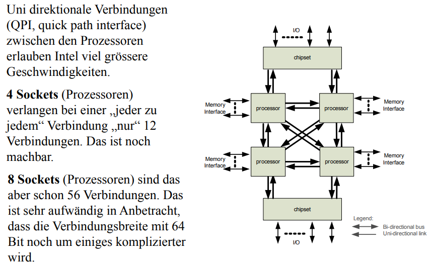

- Crossbar Switch Interconnect: Optimiert Aufwand und Ertrag der Core zu Core Verbindungen
  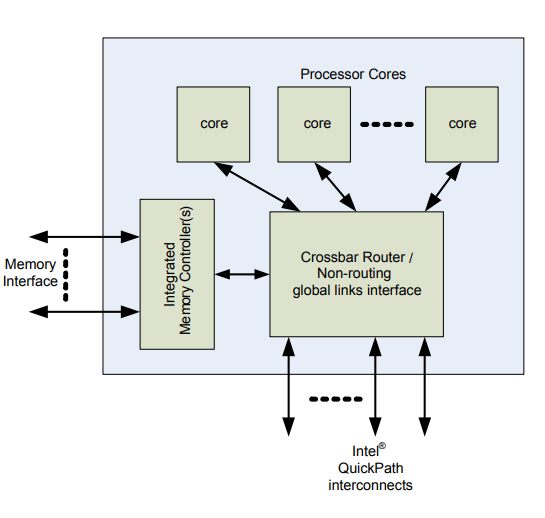

- Ring Interconnect: Bus aus 4 unabhängigen Ringen (Data, Request, Acknowledge, Snoop)

  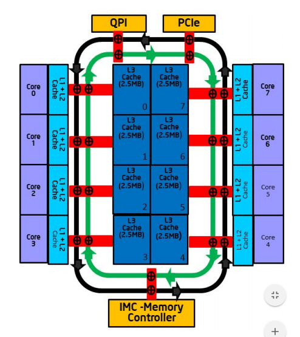

### Verbindungsnetze (Möglichkeiten)

#### Lineares Feld

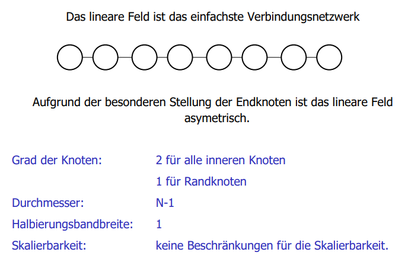

#### Ring

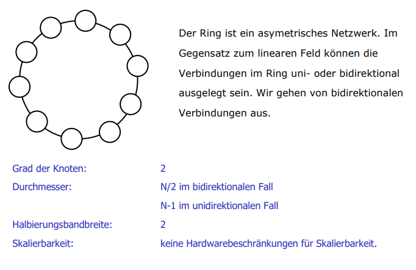

#### Stern

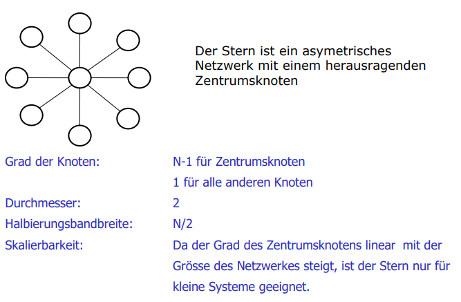

#### Baum

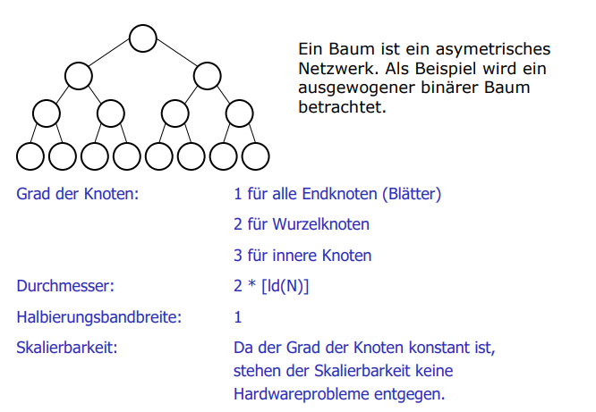

#### Hypercube

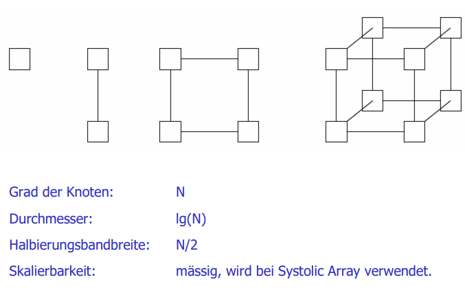

#### Koppelnetze

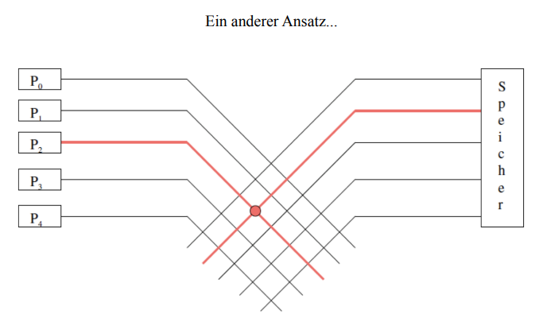

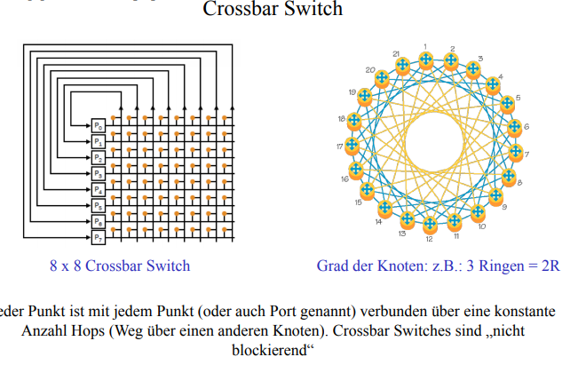

Koppelnetze (Crossbar Switch) sind nicht blockierend, da jeder Punkt mit jedem anderen Punkt verbunden ist (über eine konstante Anzahl Hops, Weg über einen anderen Knoten)

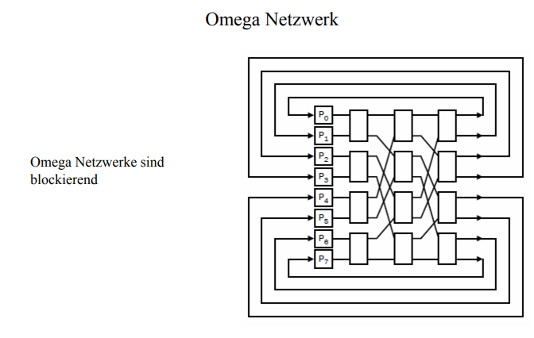

### Skalierbare Applikation

- Skalierbare Algorithmen
- Locking = verwenden von fein granularen Locking Mechanismen
- Verwenden von Worker Thread Pools
- Ausführen von Skalier-Tests
- Beobachten der skalierbaren Applikation
- Identifizieren der Orte wo wait-time involviert sind
- Identifizieren von heissen synchronization locks
- Identifizieren der nicht skalierbaren Algorithmen

## Cachekohärenz

**Problem**: Ein Prozessor weiss nicht, ob der Wert in seinem Cache noch aktuell ist oder bereits von einem anderen Prozess geändert wurde. Durch Sicherstellung der Cache-Kohärenz wird bei Mehrprozessorensystemen mit mehreren CPU-Caches verhindert, dass einzelne Caches für dieselbe Speicheradresse unterschiedliche (somit inkonsistente) Daten zurückliefern.

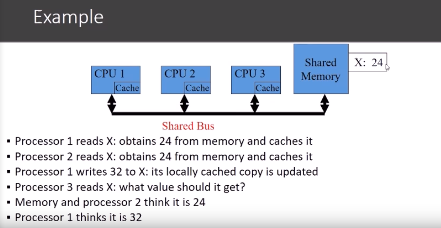

Siehe auch:

* [Problembeschreibung](https://www.youtube.com/watch?v=TMJj015C93A)
* [More](https://www.youtube.com/watch?v=0F7TA1Scp8s)

Eine temporäre Inkonsistenz zwischen Speicher und Cache ist zulässig, sofern diese spätestens bei lesenden Zugriffen identifiziert und behoben wird. Inkonsistenzen werden z.B. durch das Rückschreibeverfahren (Write-Back) erzeugt, das im Gegensatz zu einem Durchschreibeverfahren (Write-Through) beim Schreiben in den Cache-Speicher nicht sofort den Hauptspeicher aktualisiert. Vergleiche dazu [Cache-Konsistenz](https://de.wikipedia.org/wiki/Cache-Konsistenz)

[Siehe auch Wikipedia](https://de.wikipedia.org/wiki/Cache-Koh%C3%A4renz)

### Protokolle

Ein Cache-Kohärenz-Protokoll hat die Aufgabe, den Status eines gecachten Speicherblocks zu verfolgen. Im Wesentlichen gibt es zwei technische Grundlagen, auf denen ein solches Protokoll implementiert werden kann.

#### Directory-Based (Verzeichnisbasiert)

[See also](https://en.wikipedia.org/wiki/Directory-based_coherence)

Es wird eine zentrale Liste mit dem Status aller gecachten Blöcke geführt. Dort ist hinterlegt, welche Prozessoren zurzeit eine Read-only-Kopie (Status *Shared*) oder welcher Prozessor exklusiven Schreibzugriff (Status *Exclusive*) auf einen Block hat. Das Protokoll regelt den Übergang zwischen den verschiedenen Status und das Verhalten bei read miss, write miss bzw. data write back.

* Directories enthalten den Zustand von Speicherblöcken (welche Caches haben welche Kopien, welche sind dirty, etc.)
* Übliche Zustände
  * Shared (Block ist in einem oder mehreren Caches, Wert ist up-to-date)
  * Uncached (Block ist in keinem Cache)
  * Exclusive (Block gehört einem Cache, Wert ist nicht up-to-date)
* Bitvektor zeigt an, in welchen Caches der jeweilige Block gespeichert ist

Pro Speicherblock existiert ein Eintrag in einem Directory.

* Verteile Directories: Zuordnung zum jeweiligen Hauptspeicher. Enthält nur Informationen über Blöcke in diesem Hauptspeicher
  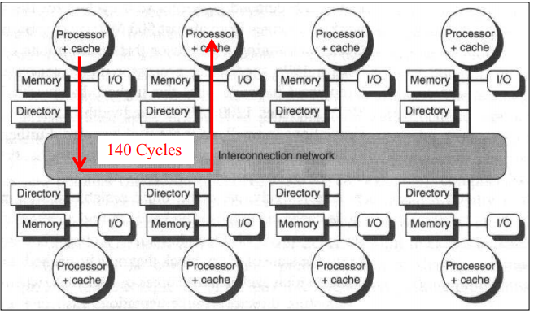
* Kombinierter Ansatz: Bus-basierte Snoopy Kohärenz und Directory-basiert über Knoten hinweg
  

Beteiligte Einheiten:

* **Local Node**: Ursache der gesamten Transaktion
* **Home Node**: Hauptspeicher und Directory, in denen die Adresse der Schreib- oder Leseanforderung liegt
* **Remote Node**: Knoten, der eine Kopie des jeweiligen Cacheblocks besitzt

Nachrichten:

**Hinweis**: Ab 64 Prozessoren oder Cores werden ausschliesslich Directory-Based Protokolle eingesetzt, da die Bandbreite des Busses nicht ausreichend skaliert.

#### Snoopingbasiert

Üblicherweise laufen Zugriffe auf den zentralen Speicher über ein gemeinsames Medium (z. B. Bus oder Switch). Alle angeschlossenen Cache Controller können dieses Medium beobachten und Schreib- oder Lesezugriffe auf Blöcke identifizieren, die sie selbst zwischengespeichert haben. Die genaue Reaktion des Controllers ist im Protokoll festgelegt.

Die Snoopy Cache hören auf den Verbindungsbus mit, um alle Schreiboperationen auf gecachte Werte, die sie auch selber halten, zu detektieren.

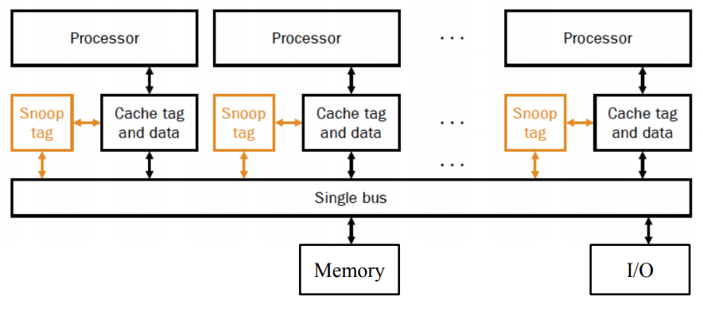

* Erweiterung der Status-Bits jeder Cachezeile
* Zusätzliche Cache-Controller, die das jeweilige Cachekohärenz-Protokoll implementieren
* Um Zugriffskonflikte zwischen CPUs zu vermeiden werden Adress-Tags und Status-Bits dupliziert (sog. Snoop tag)
* Klassifikation von Protokollen: Write-Invalidate; Write-Update (bei Write-Through); Write-Back Caches

**Wichtig**: Snoopy Protokolle sind aufwendig auf Grund der notwendigen, globalen Kommunikation. Daher die Alternative mit den Directory Protokollen.

### Weitere Möglichkeiten

* Verwendung von gemeinsamen Cache
  * grosser Hardwareaufwand
  * sequentieller Speicherzugriff
* Unterteilung der Daten
  * Ineffizient weil Daten bei paralleler Verwendung kopiert werden müssen

## Symmetrische Multiprozessoren (SMP)

Ein stand-alone Computer mit den folgenden Charakteristika:

* Zwei oder mehr gleichartige Prozessoren mit vergleichbaren
  Möglichkeiten.
* Prozessoren teilen sich das gleiche main Memory und sind über einen Bus oder andere interne Verbindungen zusammengeschaltet.
* Prozessoren teilen sich die I/O Devices.
* Alle Prozessoren können die gleichen Funktionen ausführen (daher die Bezeichnung „symmetrisch“).
* Das System wird durch ein integriertes OS kontrolliert. Dieses stellt die Interaktion her zwischen Prozessoren und deren Programmen auf dem Level  von Job, Task. File und Daten-Elementen

### Vorteile

* Performance (Parallelität)
* Scaling
* Availability
* Incremental Growth (es können weitere Prozessoren hinzugefügt werden)

## Simultaneous Multithreading (SMT)

Problem: 50% von der Prozessor Zeit ist Warten auf das Memory:

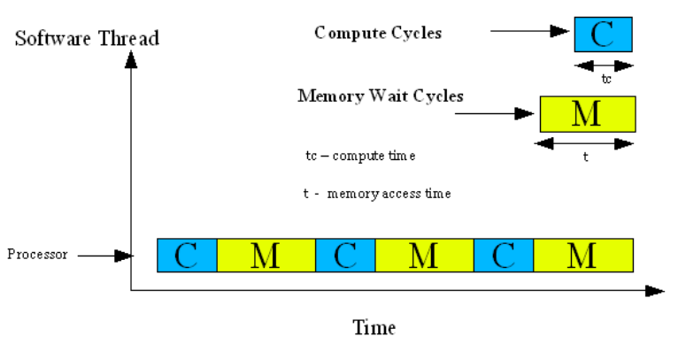

* SMT erhöht die Zahl der Transistoren um 10%
* CMP (Chip Multiprocessing) um 50%

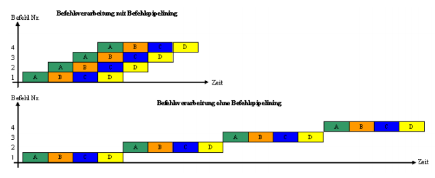

## Shared Memory Architektur (UMA)

* Alle Prozessoren (P) haben direkten Zugriff auf alle Speicherstellen (M)
* einfacher und schneller Kommunikationsmechanismus
* Private-Memory: mehrere lokale Addressräume

## Shared Memory Architektur (NUMA)

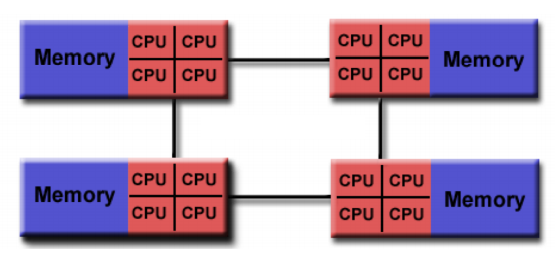

* meistens zwei oder mehr SMPs physikalisch verbunden
* Shared-Memory: ein globaler, linearer Addressraum
* Ein SMP kann auf das Memory der anderen SMPs zugreifen (remote)
* Nicht alle Prozessoren haben die gleiche Zugriffszeit auf das Memory (`Speicherzugriffszeit = f(Speicheradresse)`)
* Memory Zugriff auf "remote" Memory ist langsam
* Wenn Cache Kohärenz unterhalten wird, reden wir von CC-NUMA

## --

User homes werden gemountet und sind nicht lokal (NFS).

## Kontrollfragen
###  Was sind SMPs und wo liegen deren Vorteile?

Ein symmetrisches Multiprozessorsystem (SMP) ist eine Multiprozessor-Architektur mit folgenden Eigenschaften:
* Zwei oder mehr gleichartige Prozessoren mit vergleichbaren Möglichkeiten, wobei alle Prozessoren die gleichen Funktionen ausführen können
* Prozessoren teilen sich das Memory und sind über einen Bus oder eine interne Verbindung zusammengeschaltet.
* Prozessoren teilen sich die I/O Devices.
* Das System wird durch ein integriertes OS kontrolliert. Dieses stellt die Interaktion her zwischen Prozessoren und deren Programmen auf dem Level von Job, Task, File und Daten-Elementen.

Vorteile von SMP:
1. Erhöhte Availability & Performance durch Paralelität.
2. Scaling? (Hersteller können eine Palette von Produkten mit verschiedenen Preisen und Leistungen anbieten.)
3. Incremental Growth (Zusätzliche Prozessoren können dazu gefügt werden um die Performance zu erhöhen.)

### Erklären sie die „superskalare Architektur“

> Unter **Superskalarität** versteht man die Eigenschaft eines [Prozessors](https://de.wikipedia.org/wiki/Prozessor), mehrere Befehle aus einem Befehlsstrom gleichzeitig mit mehreren parallel arbeitenden Funktionseinheiten zu verarbeiten. Es handelt sich dabei um eine [Nebenläufigkeit](https://de.wikipedia.org/wiki/Nebenl%C3%A4ufigkeit) auf Befehlsebene, bei der die feinkörnige Nebenläufigkeit zwischen den einzelnen Befehlen ausgenutzt wird. Da Superskalartechnik nicht den Befehlssatz der Architektur verändert, wird auch von einer [Mikroarchitektur](https://de.wikipedia.org/wiki/Mikroarchitektur) gesprochen.

Eine superskalare Architektur bringt Parallelismus auf der Instruktionsebene. Daher kann der Prozessor mehr als eine Instruktion während eines Clock-Cycle ausführen indem er mehrere Instruktionen auf mehrere redundante Funktionseinheiten im Prozessor legt. 

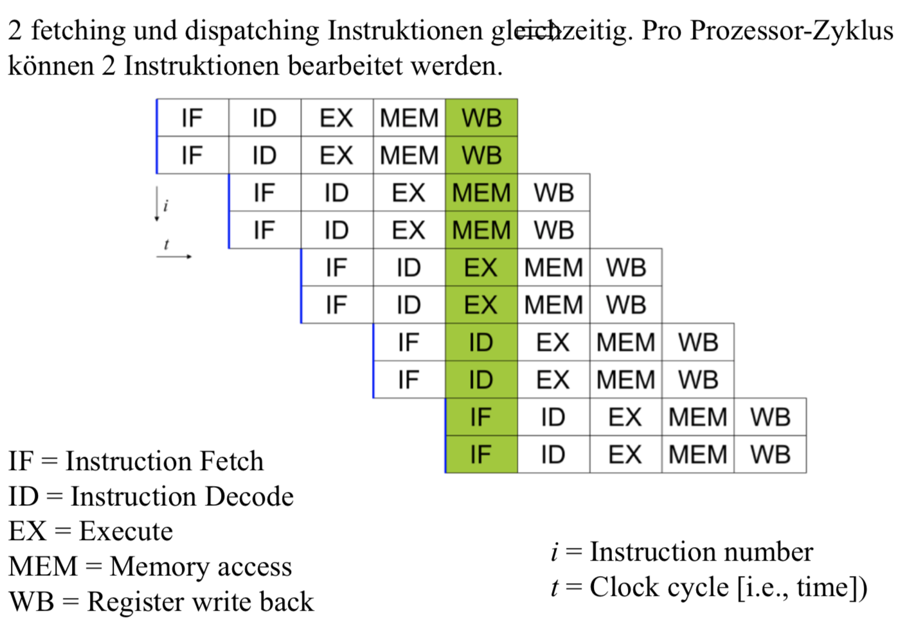

### Erklären Sie den Unterschied zwischen UMA und NUMA Memory Architekturen

Uniform Memory Access (UMA) bietet einen einfachen und schnelleren Kommunikationsmechanismus für Prozessoren, da alle Ps direkten Zugriff auf alle Speicherstellen haben.

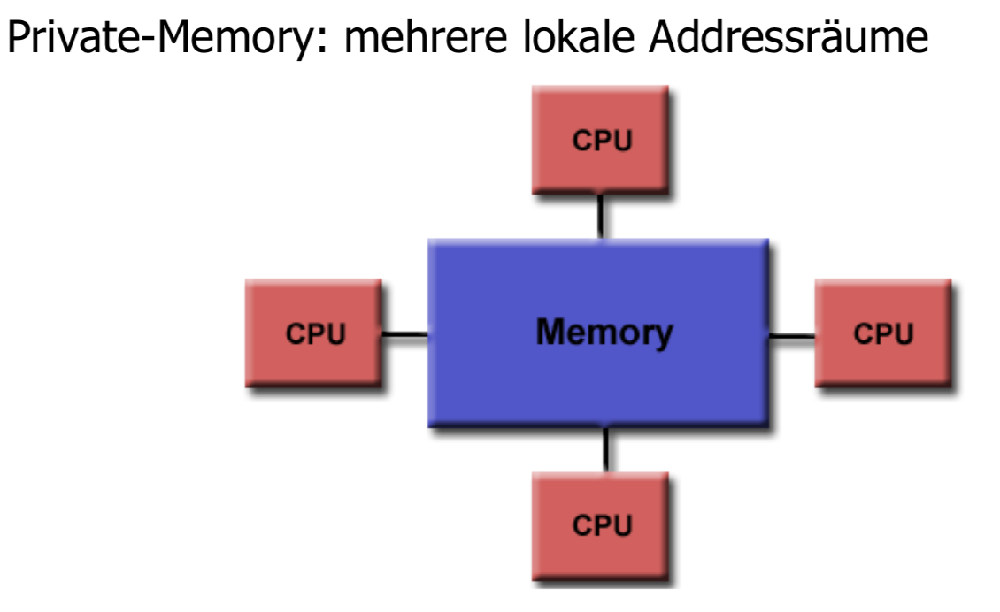

Negation

### Zeichnen sie eine gemischte UMA/NUMA Architekturen auf wo Memory lokal, sowie verteilt zum Prozessor ist.
zB: 

oder wie auf den Folien zu Frage 3 gezeigt.

### Wie werden multi Chip oder multi Core Architekturen, wie wir sie heute verwenden, genannt?

Siehe Folie: Simultanes Multi Threading

??? [https://de.wikipedia.org/wiki/Mehrkernprozessor](https://de.wikipedia.org/wiki/Mehrkernprozessor)

### Ist ein Crossbar Switch (k mal k Elemente) blockierend? Ist ein Omega Netzwerk (n Elemente \< k) blockierend? Versuchen sie eine Begründung zu liefern.
Siehe Folie Koppelnetze (2) und Koppelnetze (3)

???

### Was ist der Hauptgrund wieso ein Multi Core Chip mehrere Hardware Threads implementieren soll?
Siehe Folie: Memory Stalls und Wie lange wartet eine CPU?

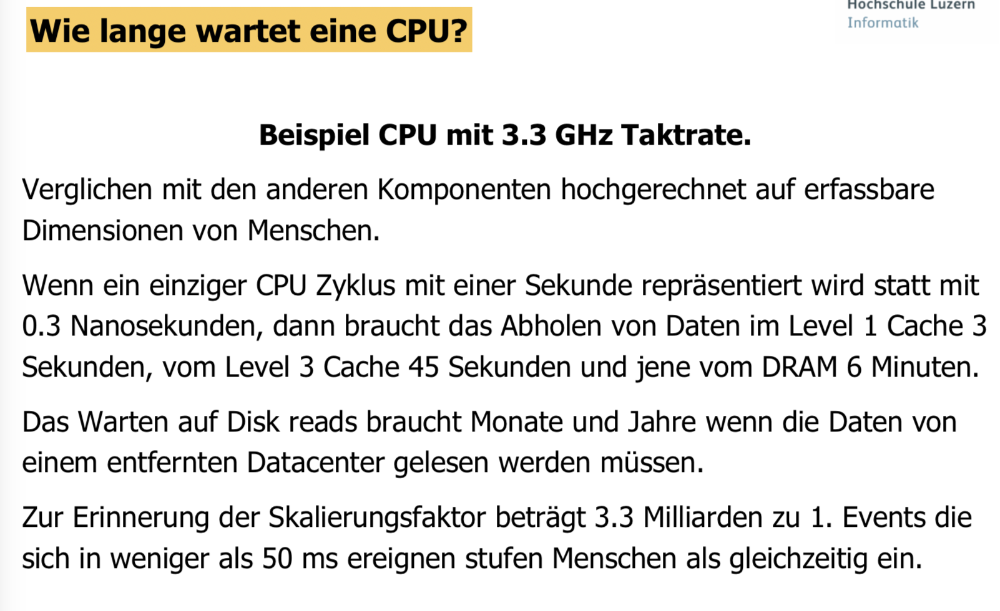

### Wie implementiert der Chip Hersteller diese Hardware Threads?
Siehe Folie: Simultanes Multi Threading und Superscalar Architecture

Teile der Architektur doppelt vorhanden.

###  Welches Problem tritt bei Multi Core Architekturen auf, das man bei single Core Architekturen mit einem L1 und L2 Cache nicht hatte?
Bei einer Multi Core Architektur können einzelnen Caches für dieselbe Speicheradresse unterschiedliche (inkonsistente) Daten zurückliefern.
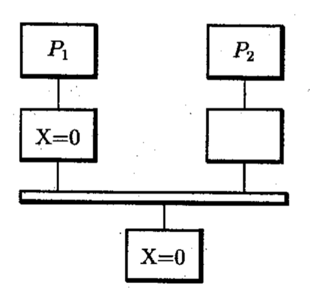

### Welche 2 Schreibstrategien gibt es bei Prozessorcaches?
Write-back & Write-through
https://de.wikipedia.org/wiki/Cache#Schreibstrategie

### Welche Cache Koherenz Protokolle gibt es und wie funktionieren sie?
**Snoopy**
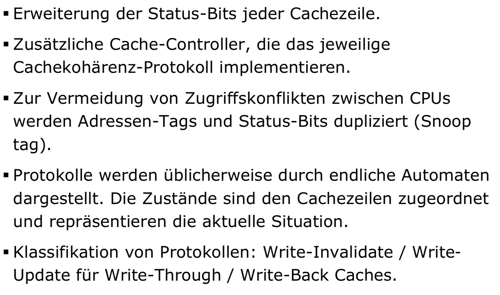
**Directory**
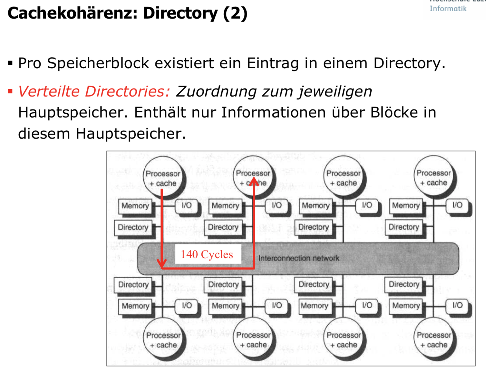

**Kombinationen**
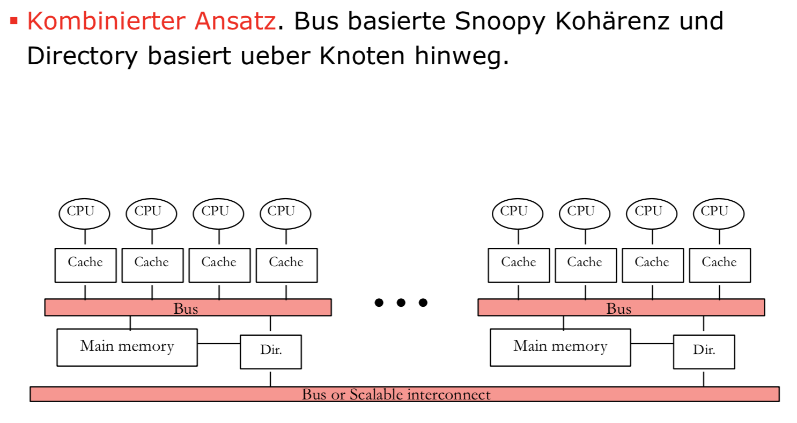

### Welche Einheiten sind beim Directory Protokoll beteiligt?
* Local Node: Ursache der gesamten Transaktion.
* Home Node: Hauptspeicher und Directory, in denen die Adresse der Schreib- oder Leseanforderung liegt.
* Remote Node: Knoten, der eine Kopie des jeweiligen Cacheblocks besitzt.

### Was besagt das unter dem Namen: „Amdahls Law“ bekannt gewordene Gesetz?
Nach Amdahl wird der Geschwindigkeitszuwachs vor allem durch den sequentiellen Anteil des Problems beschränkt, da sich dessen Ausführungszeit durch Parallelisierung nicht verringern lässt.

### Nach welchen Kriterien werden Verbindungsnetze unterschieden?
Siehe Folie Verbindungsnetzwerke, Topologie Bewertungskriterien und lesen sie: „Kennwerte Netze.pdf“