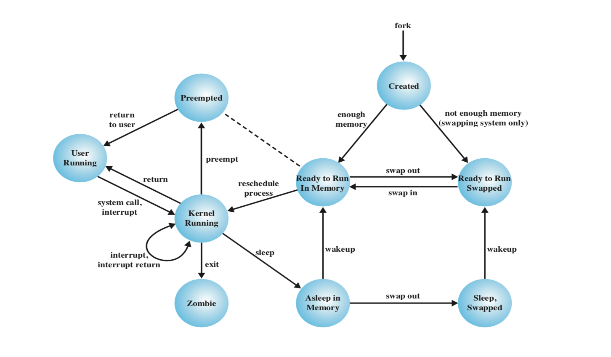
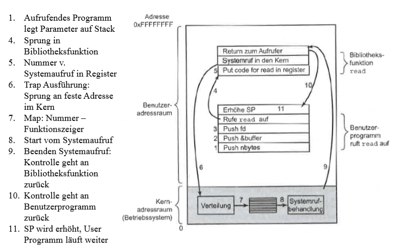
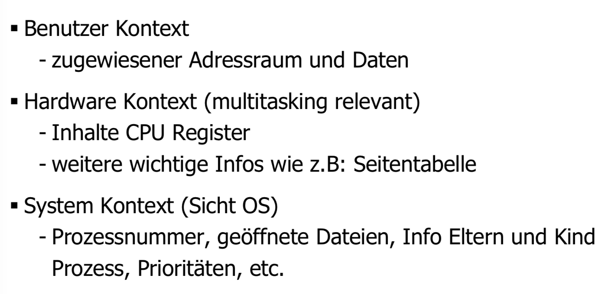
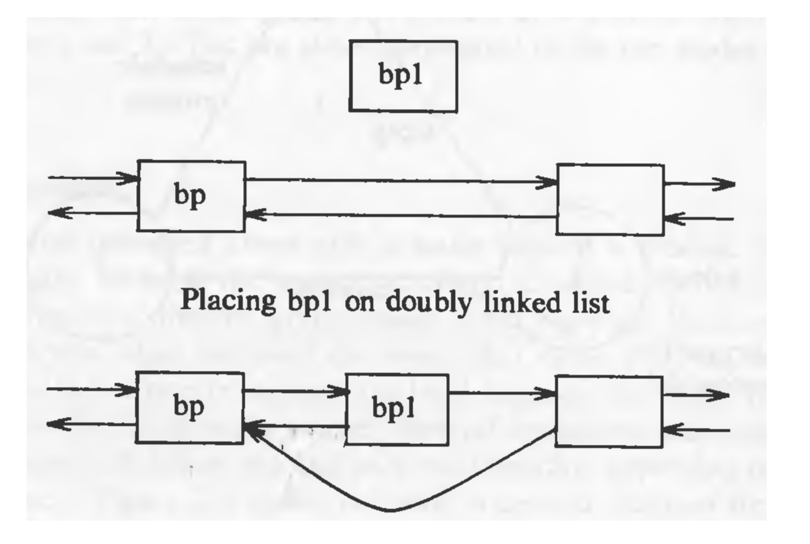

# index

## Systemsoftware

\[TOC\]

### Stoffabgrenzung

Aus 05 - Virtualisierung im Data Center:

* Sie sind mit der Systemsoftware Struktur vertraut und kennen insbesondere das Prozesssubsystem mit den Threads und Traps und können diese erklären

Geschützte Bereiche mit Systemcalls. Systemcalls liegen im Memmorybereich.

### "Systemsoftware Struktur"


### Context Switch

Systemfunktionen sind reentrant:

* mehrere Aufrufe, immer konsistent = darf daher keinen State haben

### Prozess Kontext

* Benutzer Kontext \(zugewiesener Adressraum un Daten\)
* Hardware Kontext \(multitasking relevant\)
* Inhalte CPU register
* wichtige Infos wie Page Table
* System Kontext \(Sicht OS\)
* Prozessnummer, geöffnete Dateien, Info Eltern und Kind Prozess, Prioritäten, etc.

## Process Control Structures

Um einen Prozess zu verwalten, muss das OS wissen:

* Wo der Prozess ist
* Die Attribute vom Prozess für dessen Verwaltung essentiell sind

### Process Location

* Enthält ein oder mehrere Programme \(`.text`\)
* Daten \(data\). Ein Prozess muss mindestens genug Speicher haben, um das Programm \(text\) und Daten \(data\) zu halten.
* Stack \(für die Aufrufe von Prozeduren Übergabe der Parameter\)

### Process Attributes

* Jeder Prozess hat diverse Attribute, um dem OS die Kontrolle zu ermöglichen
* Prozess Image = Sammlung aus Programm \(text\), Daten, Stack und Attribute
* Location vom Prozess Image hängt vom verwendeten Memory Management Schema ab

### Prozess Control Blocks

Wenn ein Programm ausgeführt wird kann der dazugehörige Prozess einzigartig charakterisiert werden durch ein paar Elemente wie: 

[https://en.wikipedia.org/wiki/Process\_control\_block](https://en.wikipedia.org/wiki/Process_control_block)

  

Charakteristika 


Die meisten Listen sind Double-Ended Queues. 


Memory wird zur Laufzeit Hartcodiert, zur Compilezeit wird das Memory relativ geschrieben. Loader und OS weiss wie man das machen muss. 


### Prozess-Status Wechsel

Der Prozess-Status Wechsel geschieht wie folgt: 1. Save context of the proessor \(Registerinhalte, Daten, etc.\) 2. Update the Process Control Block Status \(currently “run”\) 3. Move the Process Control Block to the queue 4. Select another processor for it’s execution \(Scheduler kommt zum Einsatz\) 5. Update the Process Control Block and update the Memory Management Data Structures. 6. Restore the context of the processor, such that he continues at the same point he stopped

Falls der momentan laufende Prozess in einen anderen Status verschoben wird \(Ready, Blocked, etc.\), dann muss das OS substantielle Wechsel in seinem Environement machen.

### Prozess-Modus Wechsel

Es wird differenziert zwischen: 1. Interrupt vorhanden: PC \(program counter\) auf den Interrupt Handler setzen & vom User Mode in den Kernel Mode wechseln, damit privileged Instructions ausgeführt werden können. 2. Keine Interrupts liegen am Prozessor an: `fetch stage` zum nächste Instruktion vom aktuellen Programm & Prozess zu holen.

Der “Modus Switch” kann ohne einen Status-Wechsel vom momentan laufenden Prozess durchgeführt werden. In diesem Falle verursacht das Speichern des Kontextes und das Anschliessende „restoring“ einen sehr kleinen Overhead.

### Ausführung im OS \(Execution Models?\)


### Prozesszustände und Übergänge \(UNIX Process Status\)

**Prüfungsstoff!** 

* **User Running**: Executing in user mode.
* **Kernel Running**: Executing in kernel mode.
* **Ready to Run, in Memory**: Ready to run as soon as the kernel schedules it.
* **Asleep in Memory**: Unable to execute until an event occurs; process is in main memory \(a blocked state\)
* **Ready to Run, Swapped**: Process is ready to run, but the swapper must swap the process into main memory before the kernel can schedule it to execute.
* **Sleeping, Swapped**: The process is awaiting an event and has been swapped to secondary storage \(a blocked state\).
* **Preempted**: Process is returning from kernel to user mode, but the kernel preempts it and does a process to switch to schedule another process.
* **Created**: Process is newly created and not yet ready to run.
* **Zombie**: Process no longer exists, but it leaves a record for its parent process to collect. Process still exists in Memory!

Scheduler kann User Mode nicht unterbrechen!

### Prozess erzeugen

Beispiel in C:

```c
if (fork() == 0){
  exec(neuesProgramm);
}

wait();

// rc 0: Im Child (zeigt an, dass es erfolgreich vom Parent geforkt hat)
// rc PID: Im Parent, die PID des Childs
```

Fork, Gabel, Vergabelung, weil jeder Prozess ein Vater haben muss.

Prozess wird durch den kernel syscall erzeugt: `fork()` Im Kernel Mode macht dann das OS folgendes: 

Clone ist performanter als komplett neu erstellen, aber bringt Risiken mit sich.

```c
                                           +-+
       +---+                               |0|
       |   |                               +-+
       |P_v|                                |
       |   |                                |
       +---+                                +-----+-+
         |                                  |     |8|P_v
         |        +---+                     +     +-+
         |        |   |                            |
         +-------->P_s|                            |
                   |   |                            +-+
                  +---+                            |8| P_s
                                                     +-+
```


### Traps

Bei einem Systemaufruf \(syscall\) wird mittels Trap vom Benutzermodus \(User Mode\) in den Kernmodus \(Kernel Mode\) gewechselt. Dabei wird eine feste Adresse im Kernel angesprungen. Im Kernel Mode wird dann mittels einer Tabelle \(syscall table\) zum entsprechenden Syscall Handler gesprungen. Die syscall table enthält Zeiger \(Pointer\) zu den entsprechenden Funktionen.



#### Laufender Prozess unterbrechen

| Mechanism | Cause | Use |
| :--- | :--- | :--- |
| Interrupt | External to the execution of the current instruction | Reaction to an asynchronous, external event |
| Trap | Associated with the execution of the current instruction | Handling of an error or an exception condition |
| Supervisor call | Explicit request | Call to an operation system function |

### What


Arten von Scheduler: 1. Fare Share Scheduler

Buffer Cache via Software realisiert im Memory.

### Prozess Adressraum


### Prozess Kontext



Passiert nicht weil OS hohe Priorität setzt  Systemfunktionen sind reentrant -&gt; Globale Variablen sind böse und es gibt bei reentrant keine

### Kontrollfragen

#### Wie kommunizieren Anwenderprogramme \(oder auch die Shell\) mit dem Kern?

Mit System Calls \(syscalls\) oder Systemaufrufen über das System Call Interface \(API/ABI\).

#### Wie werden Geräte im Unix OS behandelt?

Alle Dateien \(Devices\) werden als Datei \(File\) ins Verzeichnis `/dev` gemountet.

#### Wie unterbricht der Kern die Ausführung eines Prozesse

Mit Hilfe von Interrupts 

#### Was gehört zu einem Prozess-Image?

#### Was ist ein Prozess?

Ein Pointer zu einem Prozess Imagae

#### Was ist ein Stack?

Eine Datenstruktur, welche die LIFO/FILO Semantik implementiert.

#### Kann ein Prozess sich selber Schlafenlegen? Versuchen sie eine Erklärung abzugeben.

#### Skizzieren Sie die Zustände eines Unix Prozesses auf!

#### Was gehört zu einem Prozess Kontext?

#### Was gehört zu einem Thread Kontext?

#### Wie stellt der Kern sicher, dass seine Datenstrukturen auch bei Kontextswitches unversehrt bleiben?

#### Wieso steht die folgende Anweisung beim Erzeugen eines neuen Prozesses, Wann wird excec aufgerufen?

```c
if (fork() == 0)
    execl(neues Programm);
wait((0);
```

#### Erklären Sie die einzelnen Schritte eines Prozess Status Wechsel. Ist ein Modus Switch das gleiche?

Nicht das gleiche

#### Erklären sie den Ablauf eines Traps im Detail

#### Wieso sind Threads so beliebt \(Vorteile im allgemeinen\)?

#### Welches sind die Vorteile von ULTs \(user level threads\)?

Einfachheit, Portabilität \(POSIX\) und günstige Kontextswitches \(in Linux werden Kernel-Threads als normale Prozesse abgebildet, welche die selben Ressourcen teilen.

#### Nennen sie einen gewichtigen Nachteil von ULTs.

#### Nennen Sie Vorteile von KLTs \(kernel level threads\)

\[[http://www.cs.iit.edu/~cs561/cs450/ChilkuriDineshThreads/dinesh's files/User and Kernel Level Threads.html\]\(http://www.cs.iit.edu/~cs561/cs450/ChilkuriDineshThreads/dinesh's files/User and Kernel Level Threads.html](http://www.cs.iit.edu/~cs561/cs450/ChilkuriDineshThreads/dinesh's%20files/User%20and%20Kernel%20Level%20Threads.html]%28http://www.cs.iit.edu/~cs561/cs450/ChilkuriDineshThreads/dinesh's%20files/User%20and%20Kernel%20Level%20Threads.html)\) [https://stackoverflow.com/questions/34569354/benefits-of-user-level-threads](https://stackoverflow.com/questions/34569354/benefits-of-user-level-threads)

