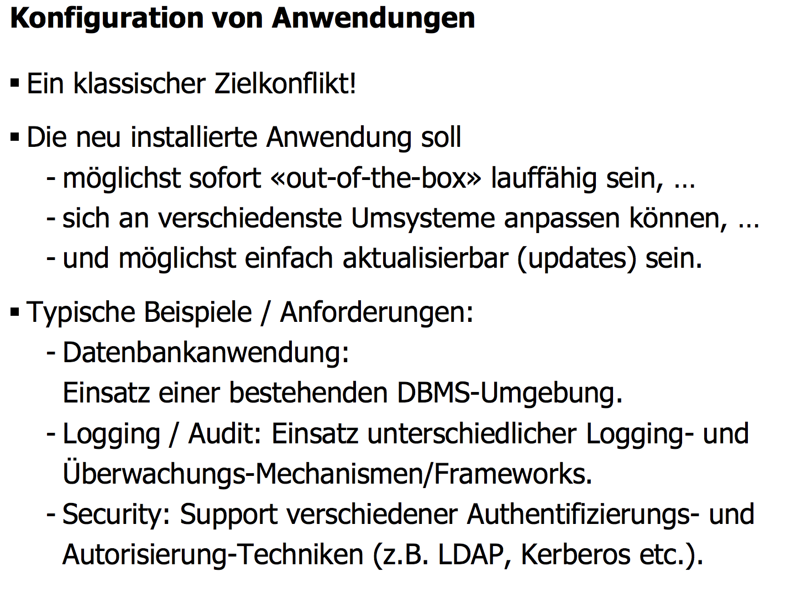
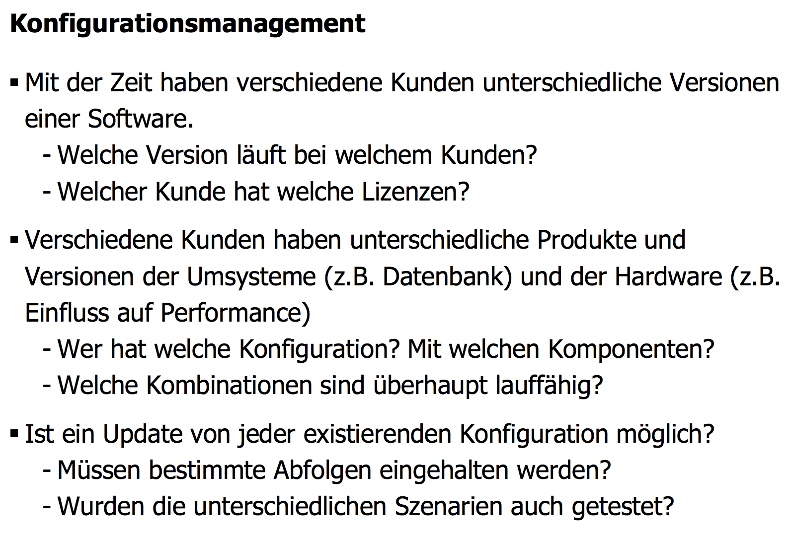
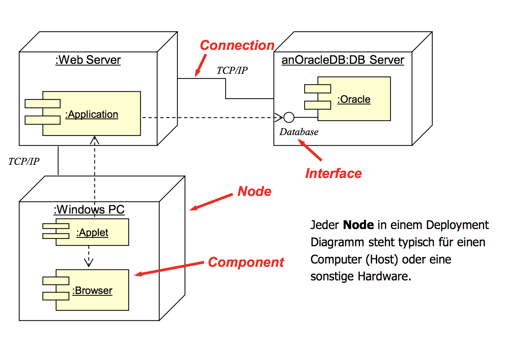
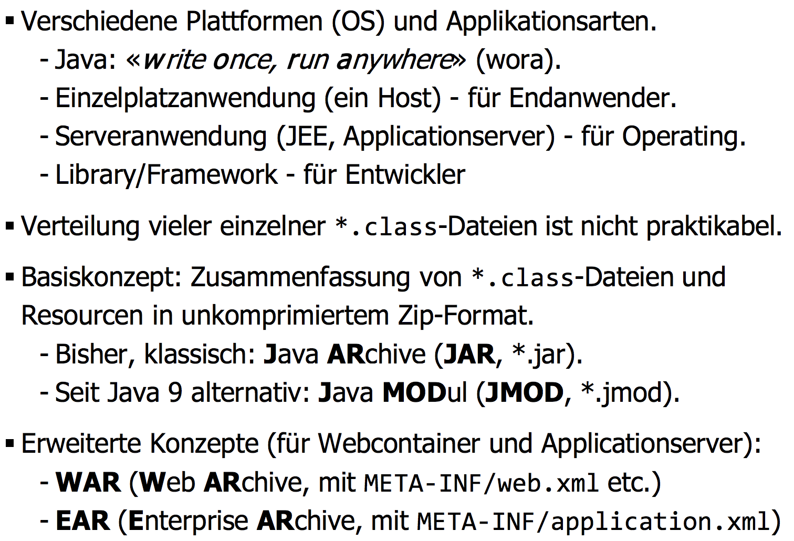
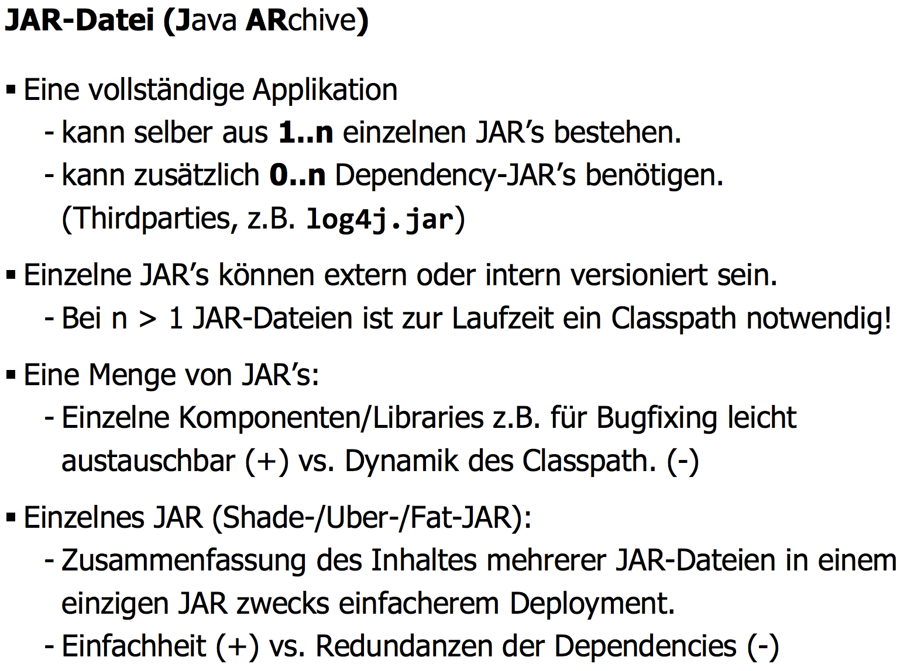
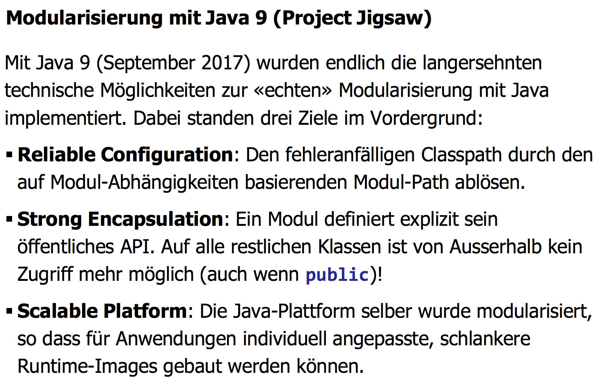
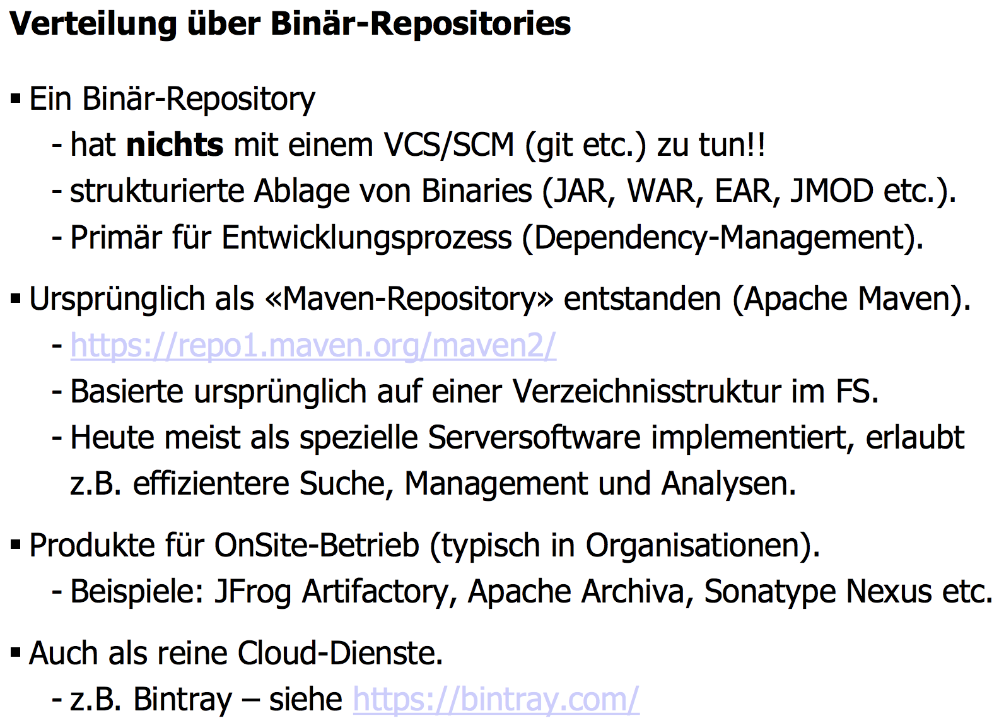

# Deployments

## Lernziele

* Sie kennen die verschiedenen Aspekte die es beim Deployment zu beachten gibt
* Sie verstehen einfache Deploymentdiagramme und können diese erstellen
* Sie kennen SemVer und können es anwenden 
* Sie kennen Sinn und Zweck eines Binär-Repository und können dieses nutzen
* Sie kennen verschiedene Deployment-Arten von Java und können diese umsetzen

## Übersicht
Ein Deployment besteht aus folgenden Punkten:
  - **Verteilung**: Versand von Datenträgern mit Programm und Dokumentation, zur Verfügung stellen von entsprechenden Downloads, automatisiertes Installation (z.B. Java Webstart).
  - **Installation**: Kopieren der nötigen Dateien an die vorgesehenen Orte und Registrieren der Anwendung, allenfalls überprüfen, ob das Zielsystem für die Anwendung geeignet ist. 
  - **Konfiguration**: Einstellungen der/des Programme(s) auf Benutzer, Netzwerkumgebung, Hardware etc. 
  - **Organisation**: Information, Schulung, Support, Planung, Produktion

Ein Deployment findet auf jeden Fall am ende eines Projektes statt. Jedoch auch früher/häufiger bei Continuous Delivery (so z.B. am Ende nach jedem Sprint oder nach jedem entwickelten Feature). Bei Continuous Deployment werden einzelne Build-/Sprint-/Iterationsergebnisse fortlaufend deployed (z.B, auf interne Testumgebungen oder direkt beim Kunden).

> Staging ist Deployment auf verschiedenen Umgebungen (Entwicklung, Test, Integration, Produktion, usw.)

Technisch gesehen besteht ein Deployment aus folgenden Aspekten:
  - **Deployment Diagramme** (Zuordnung Komponenten/Hardware)
  - **Installations- und Deinstallationsprogramme/-skripe**
  - **Konfiguration** (Default~, Beispiel~,etc.)
  - **Installationsmedium**
  - **Repositories** 

Organisatorisch gesehen besteht ein Deployment aus folgenden Aspekten:
  - **Konfigurationsmanagement** (Welche Komponenten bilden welchen Release?)
  - **Installations- und Bedienungsanleitungen**
  - **Erwartungsmanagement** (Welche Funktionalität ist vorhanden?)
  - **Bereitstellung von Support**

> Deployment-Dokumentation als Quelle der Information!!!!

### Aspekte (ein Müll)

## Deployment Diagramme

### UML 1.x

### UML 2

## Versionierung

### Semantic Versioning
Einmal [SemVer.org](https://semver.org/) durchlesen...

### Release Notes
Sauberes Nachführen von allen Änderungen, Erweiterungen und Korrekturen.
Meist manuell nachgeführt, da qualitative Aussage.
Evt. unterstützt durch Issue-Tracking-Systeme.
Für Entwickler die zentrale Informationsquelle um die Möglichkeit bzw. die Notwendigkeit einer Migration auf eine neue Version (und das damit verbundene Risiko) einschätzen zu können.

### Alternative: Time-Based Release Versioning

* Man hält einen festen Rythmus von Release-Terminen ein (Zeitpunkt meistens in der Versionsnummer enthalten)
* Beispiele wie Ubuntu: 17.04, 17.09, 18.04 ... (YY.MM Format für Jahr und Monat)

## Technisches Deployment

