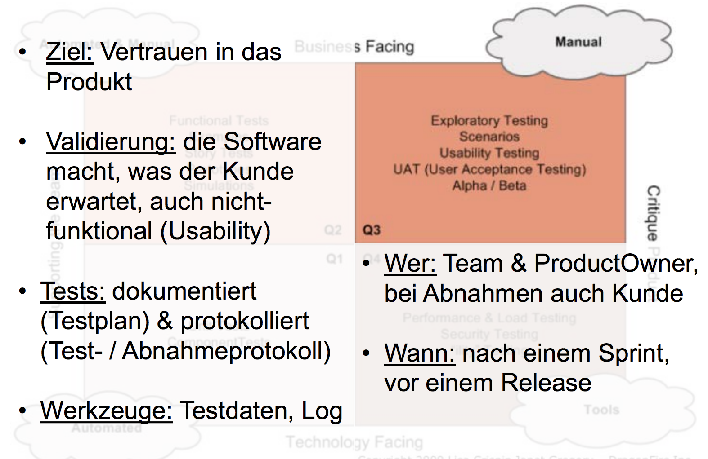

# Integration and System Testing

## Lernziele

* Sie können Komponenten entwerfen, dokumentieren, in Java realisieren, _testen_ und deployen.
* Sie kennen die Zusammenhänge zwischen Analyse/Design und _Test/Abnahme_ von Softwarekomponenten.
* Sie können geeignete Systemtests definieren, diese dokumentieren und die Durchführung protokollieren.
* Sie wissen, welche Informationen über die zu entwickelnde Software wann, wie und wo dokumentiert werden sollen.
* Sie wissen, welche Informationen aus dem Entwicklungsprozess gemäss SoDa wann, wie und wo dokumentiert werden sollen.
* Sie können Sprintbacklogs für ein kleines Team formulieren, schätzen und _geeignete Abnahmekriterien_ festlegen.

## Grundlagen

Mit dem V-Modell lässt sich der Zusammenhang zwischen den verschiedenen Disziplinen (Requirement Engineering, Design, Implementierung) und deren Verifikation mittels Tests aufzeigen.

Beim Testen ist es wichtig Tests zu dokumentieren oder zu automatisieren, um so Regressionstests zu erreichen. 
Mit keiner Testart und mit keinem Review findet man alle Fehler. 
Nur im Zusammenwirken der unterschiedlichen Techniken findet man ein Maximum an Fehlern. 

## Integration Testing

Integrationstests prüfen **die Schnittstellen und das Zusammenspiel** der Systemkomponenten.

Alle zu integrierenden Units / Komponenten sollten bereits erfolgreich getestet sein (allerdings kann eine Komponente oft erst im Verbund mit andern vollständig getestet werden).

> Code, der im statischen Testumfeld erfolgreich lief, kann in dynamischer Umgebung immer noch Fehler auslösen!

Getestet werden:
  - Interfaces (Objekt Kompatibilität, Aufruf Sequenzen, Wer validiert Inputs, usw.)
  - Datenabhängigkeiten (für jede Komponente ermitteln, welche Datenabhängigkeiten bestehen und diese testen)
  - CallGraph Abdeckung (verschiedene Aufrufvarianten testen)

Dabei gibt es verschiedene Integrationsstrategien:
  - Bottom-Up the Small (Kleinere Teilsysteme lassen sich bottom-up integrieren)
  - Top-Down the Controls (bei aufwändigen Strukturen mit Hilfe von Stubs top-down vorgehen)
  - Big-Bang the Backbone (Was für den weiteren Testablauf benötigt wird in einem Aufwisch zusammenführen?!?!)
  - Continuous Integration (Bei iterativ-inkrementeller Entwicklung neu dazu gekommenes laufend integrieren und testen)

## Platzhalter

In der Regeln sind bei inkrementeller Entwicklung nicht alle zu testenden Komponenten fertig gestellt. Deshalb ist es unverzichtbar, fehlende Komponenten durch Platzhalter zu ersetzen um Integrations- und Systemtests nicht zu blockieren. Es wird in folgende Platzhalter (Test Doubles) unterschieden:

* Stubs: Ein Stub ersetzt einen benötigte Komponente durch einen Ersatzbaustein mit identischem Interface, der nach festem Muster (ausgewählte) Reaktionen bzw. Berechnungsergebnisse zurück gibt. Aus Sicht des Testfalls fungiert ein Stub damit wie ein zusätzlicher indirekter Test-Input-Parameter (indirect input).
* Mocks: Ein Mock ist ein «intelligenter» Stub, der die Aufrufe und Daten, die er vom Testobjekt erhält, auswertet, auf Zulässigkeit und Korrektheit prüft und abhängig von dieser Auswertung eine Reaktion  bzw. ein Berechnungsergebnis an das Testobjekt zurückgibt. Aus Sicht des Testfalls fungiert ein Mock wie ein zusätzlicher Verifikationsschritt für ‘indirect Output’ des Testobjekts.

## System Testing

Systemtests prüfen die gesamte Wirkungskette im Softwareprodukt, Aspekte, die mit Unit-Tests und Integrationstests nicht abgedeckt werden.

Testfälle sollen in einer Testumgebung ablaufen, welche der späteren Einsatzumgebung möglichst nahe kommt.  Sobald mehrere Komponenten zusammen funktionieren müssen, gibt viele mögliche Konfigurationen, die entsprechend der Vorgaben des Konfigurationsmanagements zu testen sind.

Systemtestfälle können grundsätzlich den im Backlog formulierten Anforderungen und Akzeptanzkriterien abgeleitet werden.

### Systemtestfälle

// TODO

Systemtestfälle können grundsätzlich abgeleitet werden aus:
- den im Backlog formulierten Anforderungen
− den im Backlog formulierten Abnahmekriterien
− zugehörigen, detaillierteren UseCase-Beschreibungen.
− der «Definition of Done»
• Nicht funktionale Anforderungen werden oft wenig explizit festgehalten,
entsprechend kommen auch nicht funktionale Tests zu kurz:
Last- / Performance- / Stress- / Security- / Robustness- Tests
sind ebenfalls wichtige Systemtests.
• Wie beim Test-first-Ansatz auf Unittest-Ebene fördert auch
das Formulieren der Systemtests das Verständnis der Anforderungen
im Backlog und bringt Unklarheiten und Inkonsistenzen frühzeitig zu Tage.

## Regressionstests

Bereits realisierte und getestete Features müssen nach jeder Änderung / Erweiterung der Software erneut getestet werden.

## Dokumentation

Integrations- und Systemtests werden als Regressionstest auch in späteren Sprints immer wieder gebraucht und genutzt. Damit Integrations- und Systemtests wiederholbar sind, müssen sie nachvollziehbar dokumentiert werden.
Wichtige Bestandteile der Beschreibung eines Testfalls sind:

  - die Vorbedingungen für die Testausführung
  - die Handlungen und Eingaben für die Durchführung des Tests
  - die erwarteten Ergebnisse und Nachbedingungen 

## Agile Testing 

> Da hat sich jemand aber richtig Mühe gegeben um diese Folien zu designen :)

### Q1: Unit- und Komponententest

### Q2: Funktionale Tests

### Q3: Abnahmetests

### Q4: Performance, Last, etc. Tests

## Testing in SoDa (scheiss SoDa)

Ein Sprintziel muss es sein, die Fertigstellung von Features zu mit Hilfe von Abnahmetests prüfen zu können.

Konsequenz davon ist, dass im Taskboard zu den in diesem Sprint geplanten UserStories auch die erforderlichen Integrationstests, Systemtests und Abnahmetests eingeplant werden müssen.
Natürlich müssen auch die jedes Mal zunehmenden Regressionstests eingeplant werden.

## Zusammenfassung

*  V-Modell - verifizieren und valideren
* poking around is a waste of time
* Testausbeute > verschiede Testarten
* Integration Testig, Fokus auf Schnittstellen und Zusammenspiel der Komponenten
* System Testing Fokus auf die gesamte Wirkungskette des Softwareprodukts
* Regression Testing: nach jeder Änderung / Erweiterung die Software erneut testen
  * nur machbar wenn dokumentiert / automatisiert
* Agile Testing: supporting the Team / critique the Product
* SoDa:
  * Testplanung im PMP (Philosophie & nicht-automatisierte Testfälle)
  * Separates Testprotokoll pro Release
  * Jede UserStory hat Akzeptanzkriterien
  * Zeit für Testen (Regression!) in Sprintplanung mitplanen