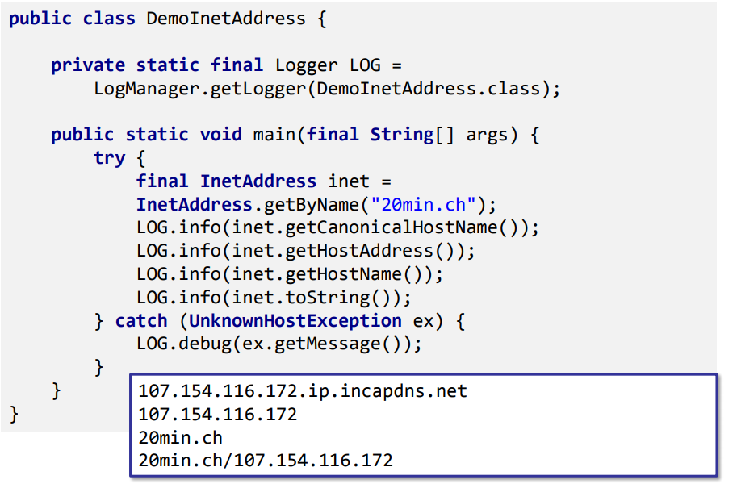
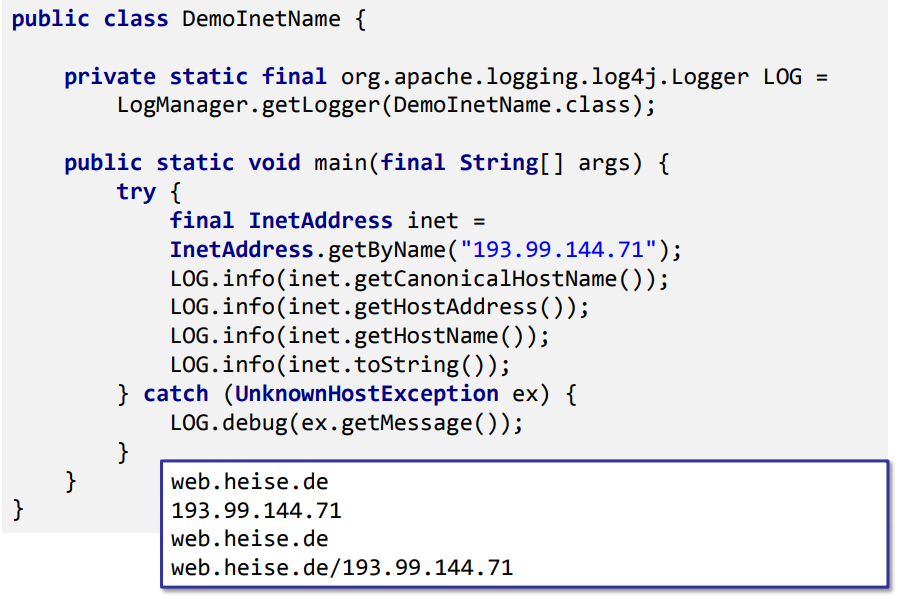
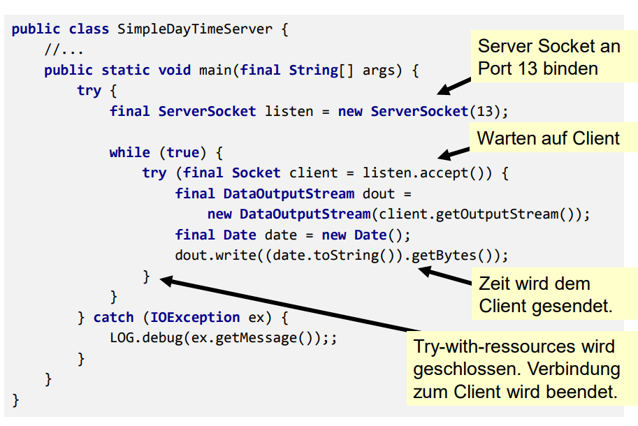
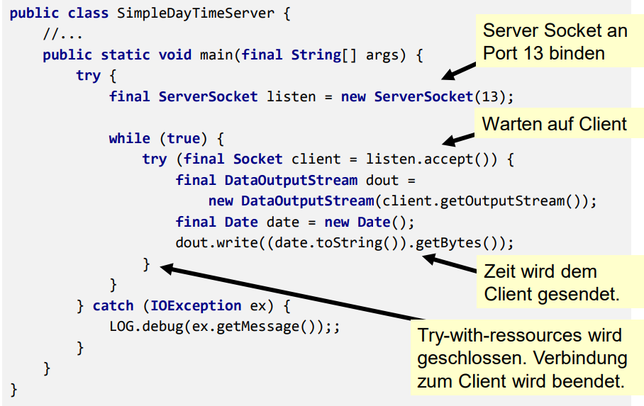

# Java Network Programming

## Lernziele

* Sie kennen die wichtigsten Begriffe aus den Netzwerk Konzepten kennen, die man für die Java Netzwerkprogrammierung benötigt (Siehe [Voraussetzungen](network-programming.md#Voraussetzungen))
* Sie wissen, welche Aktionen nötig sind, um Daten verbindungsorientiert senden zu können (Siehe [1. Abschnitt im Teil TCP-Sockets](network-programming.md#TCP-Sockets))
* Sie kennen den Lebenszyklus eines TCP Servers und können die einzelnen Elemente mit einem Java Programm in Beziehung stellen. (Siehe [2. Abschnitt im Teil TCP-Sockets](network-programming.md#TCP-Sockets))
* Sie wissen was ein Netzwerk Interface ist und wie dieses in Java repräsentiert wird (Siehe [im Teil Network Interfaces](network-programming.md#Network%20Interfaces))
* Sie können sowohl Java Client-Programme sowie Java Server- Programme analysieren und implementieren. (Siehe Beispiele \(TODO\) oder Projekt)

## Netzwerkkonzepte

### Schichten eines Netzwerk

Die Internet Kommunikation benutzt das vier Schichten Modell:

* Application Layer (HTTP, SMTP, DNS, etc)
* Transport Layer (TCP, UDP)
* Internet Layer (IP)
* Network Layer (VDSL, Ethernet, WLAN, tetc)

## Voraussetzungen

Sie sind mit folgenden grundlegenden Begriffen vertraut:

* Host
* IP-Adresse
* IP\(v4/v6\)
* DNS
* ISO/OSI-Layer
* Ports 
* Sockets
* Protokolle \(TCP, UDP\)
* Client/Server Prinzip

## Java Network API

Die wichtigsten Klassen für die Netzwerkprogrammierung sind unter `java.net.*` zu finden.

### Umgang mit Host- und IP-Adressen \(InetAdress\)

Eine `InetAdress` lässt sich mit der Methode `static InetAddress getByName(String host)` erzeugen. Als `host` kann der Hostname oder die IP-Adresse angegeben werden.

Folgende Methoden dienen zum Abfragen dieser Adresse:

* `getHostName()`: für den Hostnamen
* `getHostAddress()`: für die IP-Adresse
* `getCanonicalHostName()`: für den FQDN

Mit der Methode `isReachable(int msecTimeout)` lässt sich ein Ping absetzen.

Mit der Methode `getLocalHost()` kann die eigene Adresse abgefragt werden. Die eigene Adresse wird beim Start der JVM gecached und zeigt somit keine Änderungen zur Laufzeit \(bzw. immer den gleichen Wert\).

Mit der Methode `isSiteLocalAdress()` kann überprüft werden, ob eine Adresse im lokalen Netzwerk ist.

### IP-Adressen finden



### Hostnamen finden




### TCP-Sockets

Um Daten verbindungsorientiert zu versenden, sind folgende Aktionen nötig:

* Socket erzeugen
* Socket an einen lokalen Port binden \(Verbindung herstellen\) 
* Daten über Socket lesen/schreiben
* Socket schliessen

Ein Server wird durch die Klasse `ServerSocket` repräsentiert. Der Lebenszyklus eines TCP Servers sieht wie folgt aus:

1. ServerSocket mit Port erzeugen
2. Mit `accept` auf eine Verbindung warten
3. In- und Outputstreaam mit dem Socket verknüpfen
4. Daten lesen und schreiben, entsprechend dem vereinbarten Protokoll
5. Connection schliessen
6. Beim Schritt 2. weitermachen oder ServerSocket schliessen

> Bei der Vergabe eines Ports \(beim erstellen eines Sockets\) in Unix-Systemen können nur Root-Besitzer Port-Nummern unter 1024 nutzen

Der Dienst und die Kommunikation mit dem Client sollte nebenläufig ausgeführt werden.

Beispiel:



### Network Interfaces

Ein Netzwerk Interface ist ein Netzwerk Adapter NIC \(network interface card\). Ein Netzwerk Adapter kann auch eine Software sein, z.B. ein Loopback Interface \(127.0.0.1 für IPv4 und :::1 für IPv6\).

Heutige Rechner besitzen mehr als ein Netzwerk Adapter. Beim Erstellen des Server Sockets oder Datagramm Sockets kann \(muss\) der Netzwerk Adapter angegeben werden.

Die Klasse `NetworkInterface` repräsentiert eine Netzwerkschnittstelle. Die Netzwerk-Adapter können mit der Methode `getNetworkInterfaces()` ausgelesen werden.

Auf dem `NetworkInterface` können `InetAdress` des Interfaces mit `getInetAddresses()` ausgelesen werden.

Um einen Server Socket einem bestimmten Netzwerk Adapter zuzuordnen, stehen überladene Konstruktoren zur Verfügung. Zudem muss dem Server Socket noch die Grösse der Warteschlange \(Parameter backlog\) für anstehende Clients mitgegeben werden. Die Signatur des Konstruktors sieht wie folgt aus:

```java
  ServerSocket (final int port, final int backlog, final InetAddress bindAddr) throws IOException
```


## Beispiel: TCP Server




## Beispiel: Senden und Empfangen

