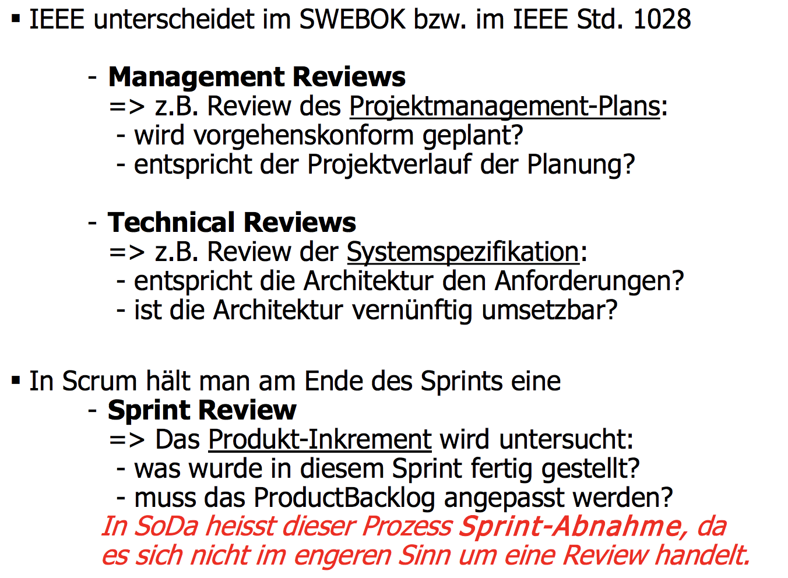

# Reviews

## Lernziele

### Sie kennen Arten, Zweck und Bedeutung von Reviews

### Sie können ein Review durchführen und protokollieren

## Arten, Bedeutung und Zweck von Reviews

## Durchführung von Reviews
Review-Sitzungen sollten **nicht länger als zwei Stunden dauern**.
Überprüfe bei jeder Sitzung nur ein Objekt / Artefakt eines Autors (oder mehrere kleine verwandte Objekte / Artefakte).
Die Teilnehmer erhalten die Objekte / Artefakte einige Tage vor der Review-Sitzung.
Es ist wichtig, dass sich alle Mitglieder des Review-Teams darauf vorbereiten, d.h. die Unterlagen ernsthaft studieren.
Der Leiter der Review geht die Objekte / Artefakte Seite für Seite durch und frägt die Teilnehmer, ob sie Kommentare zu einem bestimmten Abschnitt oder einer bestimmten Seite haben.
Entdeckte Fehler und aufgeworfenen Probleme werden in einem standard Reviewprotokoll festgehalten.
Beim klassischen Projektvorgehen sind Reviews eng an den Projektlebenszyklus gekoppelt. Sie müssen deshalb dann angesetzt werden, wenn die zu überprüfenden Objekte / Artefakte vorliegen sollten.
Reviews bringen das beste Aufwand/Ertragsverhältnis, wenn übergeordnete Objekte / Artefakte überprüft werden (besser Anforderungen & Konzepte reviewen statt Detail-Design & Code)

Die Art und Weise, wie eine Review organisiert wird, ist wichtig. 
Der erste Zug muss so aussehen, als käme er vom Autor und nicht vom Gutachter. 
Der Autor muss sich mit der Idee der Review wohlfühlen.
Reviews sind im zuerst eine zwischenmenschliche Angelegenheit, der Erfolg hängt von der persönlichen Dynamik zwischen Autor und Reviewer ab. 
Es ist wichtig flexibel zu sein, wer wessen Arbeit reviewed, d.h. kompatible Paare sich gegenseitig suchen lassen.
Ein guter Reviewer ist nicht wertend und erkennt, dass der primäre Nutzen einer Review darin besteht, dass man gemeinsam über ein Werk spricht.
Mögliche oder tatsächliche Fehler, die in einem Review gefunden werden, soll man nicht an die grosse Glocke hängen, sondern möglichst lokal lösen.
